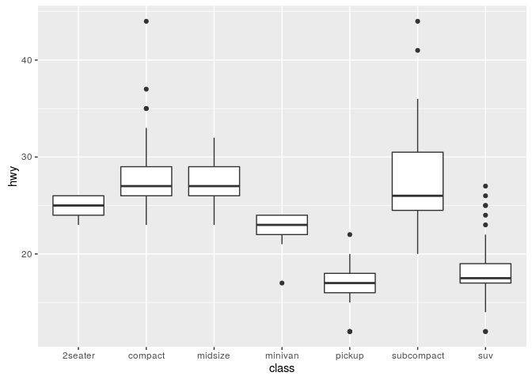
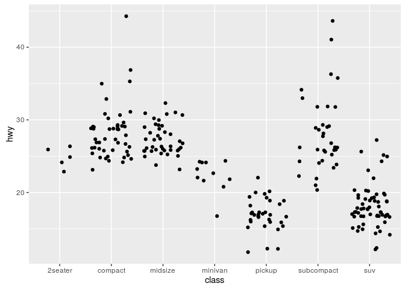
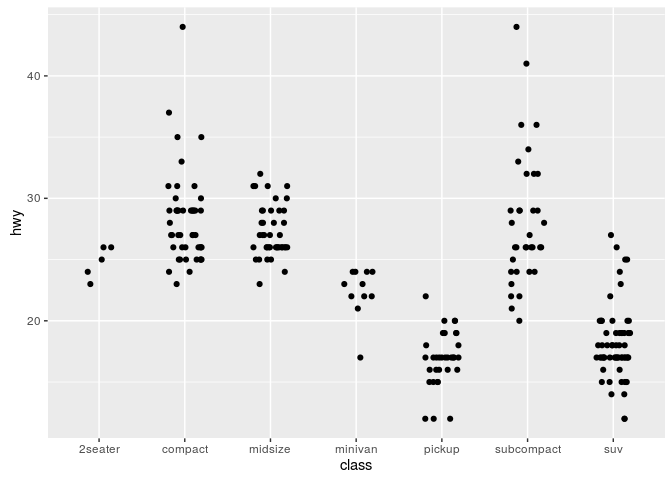
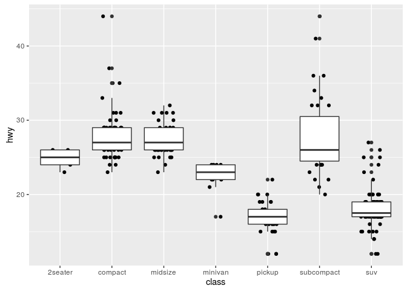
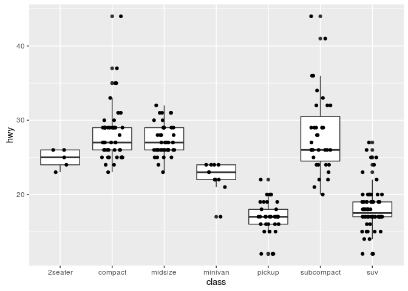
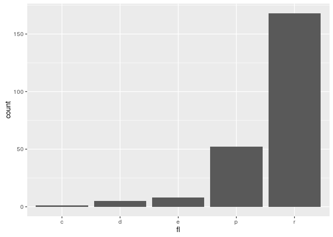
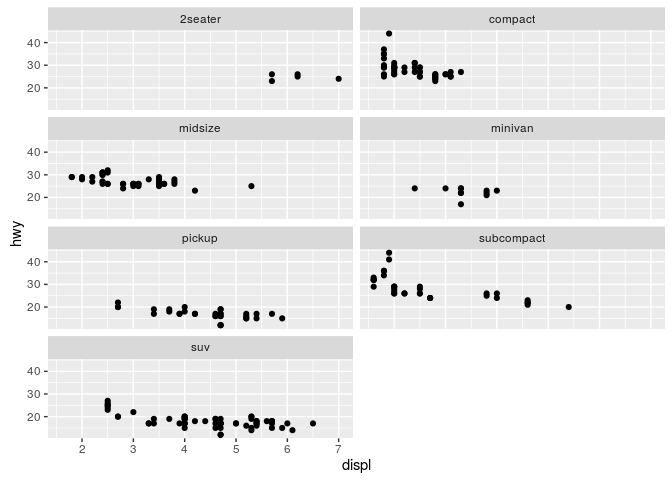
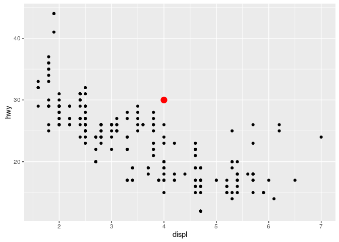

ggplot2
================
Pierre Gestraud
4 octobre 2016

### Example data

``` r
head(mpg)
```

    ## # A tibble: 6 × 11
    ##   manufacturer model displ  year   cyl      trans   drv   cty   hwy    fl
    ##          <chr> <chr> <dbl> <int> <int>      <chr> <chr> <int> <int> <chr>
    ## 1         audi    a4   1.8  1999     4   auto(l5)     f    18    29     p
    ## 2         audi    a4   1.8  1999     4 manual(m5)     f    21    29     p
    ## 3         audi    a4   2.0  2008     4 manual(m6)     f    20    31     p
    ## 4         audi    a4   2.0  2008     4   auto(av)     f    21    30     p
    ## 5         audi    a4   2.8  1999     6   auto(l5)     f    16    26     p
    ## 6         audi    a4   2.8  1999     6 manual(m5)     f    18    26     p
    ## # ... with 1 more variables: class <chr>

### Quickstart

``` r
ggplot(mpg, aes(x = displ, y = hwy)) + geom_point()
```


A plot has 3 main components:

-   data
-   a set of aesthetics
-   a set of layers (mainly geometries)

``` r
ggplot(mpg,   ## data
       aes(x = displ, y = hwy)) +  ## aesthetics
    geom_point() ## layer
```


#### add geoms

``` r
ggplot(mpg, aes(x = displ, y = hwy)) + geom_point() + geom_line()
```


### aesthetics

-   `x`
-   `y`
-   `z`
-   `color`
-   `fill`
-   `size`
-   `text`
-   `shape`
-   `alpha`
-   `group`

Set color aesthetic to `manufacturer variable`

``` r
ggplot(mpg, aes(x = displ, y = hwy, color = manufacturer)) + geom_point()
```


Set size aesthetic

``` r
ggplot(mpg, aes(x = displ, y = hwy, size = cyl)) + geom_point()
```


Alpha aesthetic

``` r
ggplot(mpg, aes(x = displ, y = hwy, size = cyl, color = class)) + geom_point(alpha = 0.5)
```


Set an aesthetic to a fixed value

``` r
ggplot(mpg, aes(x = displ, y = hwy)) + geom_point(aes(color = "blue"))
```


``` r
ggplot(mpg, aes(x = displ, y = hwy)) + geom_point(color = "blue")
```


Set an aestetic to a discrete numeric value

``` r
ggplot(mpg, aes(x = displ, y = hwy, color = cyl)) + geom_point() ## gradient scale
```


``` r
ggplot(mpg, aes(x = displ, y = hwy, color = factor(cyl))) + geom_point() ## discrete scale
```


Aesthetics can be defined inside geom

``` r
ggplot(mpg, aes(x = displ, y = hwy)) + geom_point(aes(color = class))
```


Aesthetics defined inside `ggplot` apply to all geom

``` r
ggplot(mpg, aes(x = class, y = hwy, color = class)) + geom_boxplot() + geom_point()
```


### a ggplot is an object

We can build a `ggplot` object in several steps

``` r
g <- ggplot(mpg, aes(x = displ, y = hwy)) + geom_point() 
g ## or print(g)
```


``` r
g <- g + ggtitle("hwy vs displ")
g
```


### geom

-   one variable
    -   continous
        -   `geom_density`
        -   `geom_histogram`
        -   `geom_freqpoly`
    -   discrete
        -   `geom_bar`
-   two variables
    -   continous X, continuous Y
        -   `geom_point`
        -   `geom_smooth`
        -   `geom_text`
    -   discrete X, continuous Y
        -   `geom_bar`
        -   `geom_boxplot`
        -   `geom_violin`
    -   bivariate distribution
        -   `geom_density2d`
        -   `geom_hex`
        -   `geom_bin2d`
    -   continuous function
        -   `geom_line`
        -   `geom_step`
-   three variables
    -   -   `geom_contour`
        -   `geom_tile`

#### data distributions

For histograms and densities only `x` is mandatory

``` r
ggplot(mpg, aes(x = hwy)) + geom_histogram()
```


``` r
ggplot(mpg, aes(x = hwy)) + geom_density()
```


``` r
ggplot(mpg, aes(x = hwy)) + geom_freqpoly()
```


Changing bins

``` r
ggplot(mpg, aes(x = hwy)) + geom_histogram(bins = 30)
```


``` r
ggplot(mpg, aes(x = hwy)) + geom_histogram(binwidth = 2)
```


Manually setting breaks

``` r
ggplot(mpg, aes(x = hwy)) + geom_histogram(breaks = c(10, 15, 20, 25, 30, 40, 50))
```


Add fill or color

``` r
ggplot(mpg, aes(x = hwy)) + geom_density(fill = "blue", color = "red")
```


``` r
ggplot(mpg, aes(x = hwy)) + geom_density(aes(fill = class))
```


#### Boxplots, violins, jitter

boxplots need `x` and `y` aestetics

``` r
ggplot(mpg, aes(x = class, y = hwy)) + geom_boxplot()
```



``` r
ggplot(mpg, aes(x = class, y = hwy, fill = class)) + geom_boxplot()
```


Add another variable as fill or color will separate boxplots

``` r
ggplot(mpg, aes(x = class, y = hwy, fill = trans)) + geom_boxplot()
```


Violin plots

``` r
ggplot(mpg, aes(x = class, y = hwy)) + geom_violin()
```


Jitters

``` r
ggplot(mpg, aes(x = class, y = hwy)) + geom_jitter()
```



``` r
## control width and height of jitter
ggplot(mpg, aes(x = class, y = hwy)) + geom_jitter(width = 0.5, height = 0)
```



``` r
ggplot(mpg, aes(x = class, y = hwy)) + geom_boxplot() + geom_jitter(width = 0.5, height = 0)
```


#### Bars

``` r
ggplot(mpg, aes(x = manufacturer)) + geom_bar()
```


Adding color

``` r
ggplot(mpg, aes(x = manufacturer, fill = class)) + geom_bar()
```


Changing bars positions

``` r
ggplot(mpg, aes(x = manufacturer, fill = class)) + geom_bar(position = "stack")
```


``` r
ggplot(mpg, aes(x = manufacturer, fill = class)) + geom_bar(position = "dodge")
```


``` r
ggplot(mpg, aes(x = manufacturer, fill = class)) + geom_bar(position = "fill")
```


Bar plot from count data

``` r
d <- data.frame(group = c("a", "b", "c"), n = c(10, 25 , 14))
```

``` r
## error
## ggplot(d, aes(x = group, y = n)) + geom_bar()
ggplot(d, aes(x = group, y = n)) + geom_bar(stat = "identity")
```


### add a smoother on the plot

Default smoother (loess if &lt;1000 obs, gam otherwise)

``` r
ggplot(mpg, aes(x = displ, y = hwy)) + geom_point() + geom_smooth()
```


Linear model

``` r
ggplot(mpg, aes(x = displ, y = hwy)) + geom_point() + geom_smooth(method = "lm")
```


Remove SE

``` r
ggplot(mpg, aes(x = displ, y = hwy)) + geom_point() + geom_smooth(method = "lm", se = FALSE)
```


Smooth by group

``` r
ggplot(mpg, aes(x = displ, y = hwy, color = class)) + geom_point() + geom_smooth(method = "lm", se = FALSE)
```


### Order of layers in object construction

Order of layers matters

``` r
ggplot(mpg, aes(x = class, y = hwy)) + geom_jitter(width = 0.5, height = 0) + geom_boxplot() 
```



``` r
ggplot(mpg, aes(x = class, y = hwy)) + geom_boxplot() + geom_jitter(width = 0.5, height = 0) 
```



### Scales

Scales are mainly controlled by `scale_*` functions. Their names are structured: \*scale\_'aestetic name'\_'type'\*

-   `scale_color_discrete`: discrete scale for color aestetic
-   `scale_fill_gradient`: continuous scale for fill aestetic

#### Discrete scales

``` r
ggplot(mpg, aes(x = displ, y = hwy, color = class)) + geom_point() + scale_color_discrete(h = c(20, 150))
```


``` r
ggplot(mpg, aes(x = displ, y = hwy, color = class)) + geom_point() + scale_color_brewer(palette = "Set2")
```


``` r
ggplot(mpg, aes(x = displ, y = hwy, color = factor(cyl))) + geom_point() + scale_color_manual(values = c("blue", "black", "red", "pink"))
```


``` r
ggplot(mpg, aes(x = displ, y = hwy, color = factor(cyl))) + geom_point() + scale_color_manual(values = c('8' = "blue", '6' = "black", '4' = "red", '5' = "pink"))
```


#### gradient scales

``` r
ggplot(mpg, aes(x = displ, y = hwy, color = hwy)) + geom_point()
```


``` r
## 2 colors gradient
ggplot(mpg, aes(x = displ, y = hwy, color = hwy)) + geom_point() + scale_color_gradient(low = "green", high = "red")
```


``` r
## diverging color gradient, define low, mid and high colors
ggplot(mpg, aes(x = displ, y = hwy, color = hwy)) + geom_point() + scale_color_gradient2(low = "green", high = "red", mid = "black", midpoint = 25)
```


``` r
## n colors gradient
ggplot(mpg, aes(x = displ, y = hwy, color = hwy)) + geom_point() + scale_color_gradientn(colours = terrain.colors(10))
```


#### `xlim`/`ylim` vs `coord_cartesian`

-   `xlim`/`ylim` select data inside the range
-   coord\_cartesian zoom in the plot

``` r
ggplot(mpg, aes(x = displ, y = hwy)) + geom_point()
```


``` r
ggplot(mpg, aes(x = displ, y = hwy)) + geom_point() + xlim(c(2, 6))
```


``` r
ggplot(mpg, aes(x = displ, y = hwy)) + geom_point() + coord_cartesian(xlim = c(2, 6))
```


Warning: when computing densities or smoothers, the plot will completely change by using `xlim`/`ylim`

``` r
ggplot(mpg, aes(x = displ)) + geom_density(fill = "gray50")
```


``` r
ggplot(mpg, aes(x = displ)) + geom_density(fill = "gray50") + xlim(c(2, 3))
```


``` r
ggplot(mpg, aes(x = displ)) + geom_density(fill = "gray50") + coord_cartesian(xlim = c(2, 3))
```


#### axis transformation

-   flip axes

``` r
ggplot(mpg, aes(x = displ, y = hwy)) + geom_point() + coord_flip()
```


-   polar coordinates

``` r
ggplot(mpg, aes(x = displ, y = hwy)) + geom_point() + coord_polar()
```


-   reverse axis

``` r
ggplot(mpg, aes(x = displ, y = hwy)) + geom_point() + scale_x_reverse()
```


-   log axis

``` r
ggplot(mpg, aes(x = displ, y = hwy)) + geom_point() + scale_x_log10()
```


-   order of discrete scales

``` r
ggplot(mpg, aes(x = fl)) + geom_bar()
```



``` r
## change levels order 
mpg$fl2 <- factor(mpg$fl, levels = c("e", "p", "d", "r", "c"))
ggplot(mpg, aes(x = fl2)) + geom_bar()
```


``` r
## or use xlim
ggplot(mpg, aes(x = fl)) + geom_bar() + xlim(c("e", "p", "d", "r", "c"))
```


### Themes

Themes allow to have a set of graphics with the same style. Some are predefined `theme_default, theme_bw, them_minimal, theme_gray...`

``` r
ggplot(mpg, aes(x = displ, y = hwy)) + geom_point() + theme_bw()
```


``` r
ggplot(mpg, aes(x = displ, y = hwy)) + geom_point() + theme_minimal()
```


``` r
ggplot(mpg, aes(x = displ, y = hwy)) + geom_point() + theme_dark()
```


We can customize some elements in themes (see <http://docs.ggplot2.org/dev/vignettes/themes.html> for details)

``` r
ggplot(mpg, aes(x = displ, y = hwy)) + geom_point() + theme(panel.background = element_rect(fill = "wheat"), axis.text = element_text(size = 20))
```


### Faceting

Facetting allows to display plot separately according to discrete variables

Two functions for facetting: - `facet_wrap` - `facet_grid`

``` r
ggplot(mpg, aes(x = displ, y = hwy)) + geom_point() + facet_wrap(~class)
```


``` r
ggplot(mpg, aes(x = displ, y = hwy)) + geom_point() + facet_grid(.~class)
```


``` r
ggplot(mpg, aes(x = displ, y = hwy)) + geom_point() + facet_grid(class~drv)
```


Controling facet\_wrap organisation

``` r
ggplot(mpg, aes(x = displ, y = hwy)) + geom_point() + facet_wrap(~class, ncol = 2)
```


``` r
ggplot(mpg, aes(x = displ, y = hwy)) + geom_point() + facet_wrap(~class, scales = "free")
```


``` r
ggplot(mpg, aes(x = displ, y = hwy)) + geom_point() + facet_wrap(~class, scales = "free_x")
```


All layers are faceted

``` r
ggplot(mpg, aes(x = displ, y = hwy)) + geom_point() + geom_smooth() + facet_grid(~drv)
```



### add supplementary information on plot

#### add lines

``` r
ggplot(mpg, aes(x = displ, y = hwy)) + geom_point() + geom_hline(yintercept = 20)
```


``` r
ggplot(mpg, aes(x = displ, y = hwy)) + geom_point() + geom_vline(xintercept = 4.5)
```


``` r
ggplot(mpg, aes(x = displ, y = hwy)) + geom_point() + geom_abline(slope = -2, intercept = 35)
```


#### annotate

``` r
ggplot(mpg, aes(x = displ, y = hwy)) + geom_point() + annotate(x = 4, y = 30, geom = "point", color = "red", size = 4)
```


``` r
ggplot(mpg, aes(x = displ, y = hwy)) + geom_point() + annotate(x = 4, y = 30, geom = "label", label = "annotation") 
```


#### add data from external data.frame

``` r
d_annot <- data.frame(xpos = c(2, 5, 8), ypos = c(20, 25, 40), lab = c("l1", "l2", "l3"))
ggplot(mpg, aes(x = displ, y = hwy)) + geom_point() + geom_label(aes(x = xpos, y = ypos, label = lab), data = d_annot)
```



### Programming with ggplot2

`ggplot2` use non standard evaluation (NSE). How to use variables in `aes`? `aes_string` allows standard evaluation.

``` r
my_var <- "displ"
ggplot(mpg, aes(x = my_var, y = hwy)) + geom_point()
```


``` r
ggplot(mpg, aes_string(x = my_var, y = "hwy")) + geom_point()
```


### Interactivity

For interactive graphics see `ggvis` or `plotly` packages

``` r
require(ggvis)
ggvis(mpg, ~displ, ~hwy) %>% layer_points()
```

``` r
ggvis(mpg, ~displ, ~hwy) %>%  
    layer_smooths(span = input_slider(0.2, 1, value = 1), stroke := "blue") %>% 
    layer_points(size := input_slider(10, 200, value = 50))
```

``` r
require(plotly)
g <- ggplot(mpg, aes(x = displ, y = hwy)) + geom_point()
ggplotly(g)
```

### Extensions

-   `ggrepel`: smart geom\_text and geom\_label placement
-   `cowplot`: several plots on one page
-   `ggraph`: visualise graph
-   `ggmap`: plot data on a map
-   `factoextra`: visualise results of factorial analysis (PCA, CA, MCA, MFA, ...)
-   `ggbio`: visualise genomic data
-   `ggdendro`: visualise dendrograms and trees
-   `ggthemes`: additionnal themes

### Ressources

-   <http://docs.ggplot2.org>
-   rstudio cheatsheet <http://www.rstudio.com/wp-content/uploads/2015/04/ggplot2-cheatsheet.pdf>
-   ggplot2 book <https://github.com/hadley/ggplot2-book>
