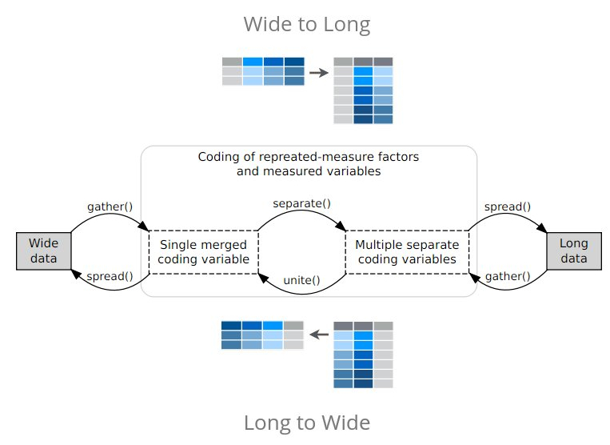
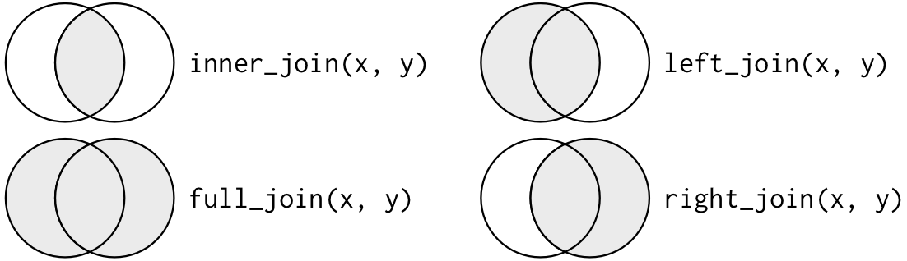
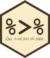
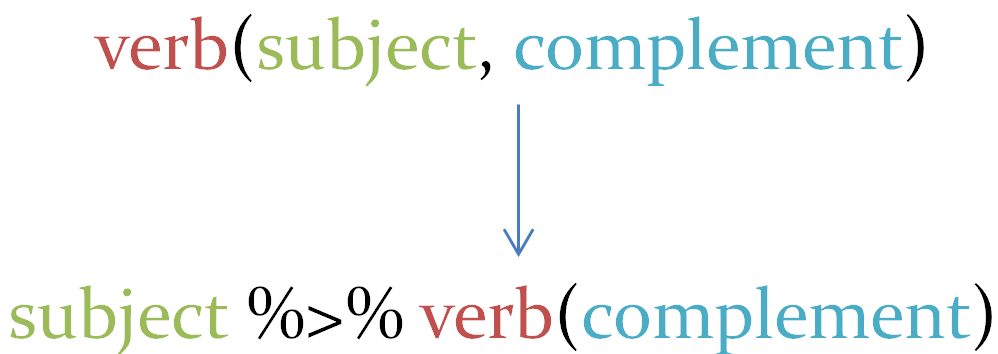

```{r setup, include = FALSE}
knitr::opts_chunk$set(echo = TRUE, 
                      include = TRUE, 
                      comment = NA,
                      highlight = TRUE,
                      fig.align = "center", 
                      out.width = "600px", 
                      cache = TRUE, autodep = FALSE)
require(tidyverse)
require(broom)
require(modelr)
require(forcats)
require(gapminder)
```


# tidyverse

* `tidyverse` is a suite of packages that follow tidy philosophy
* initiated by Hadley Wickham
* http://tidyverse.org/

Packages in tidyverse:

- Core packages: `ggplot2`, `dplyr`, `tidyr`, `readr`, `purrr`, `tibble`
- Specialized data manipulation: `hms`, `stringr`, `lubridate`, `forcats`
- Data import: `DBI`, `feather`, `haven`, `httr`, `jsonlite`, `readxl`, `rvest`, `xml2`
- Modeling: `modelr`, `broom`

Warning: tidyverse function use mainly NSE (unquoted expressions)

## Tidy data

* each variable in the data set is placed in its own column
* each observation in the data set is placed in its own row
* each value is placed in its own cell

```{r tidy_data, echo = FALSE}
knitr::include_graphics("images/tidy-1.png")
```

*Tidy Data, Hadley Wickham, JSS 2014*

## Tidy APIs

Functions should be **consistent** and  **readable**

- Take one step at a time
- Connect simple steps
- Consistency
    * almost all functions take `data.frame` as first argument and return a `data.frame`
    * all `stringr` functions take string as first argument
- Runs fast (use `RCPP`)    


# Data science workflow

```{r workflow, echo = FALSE}
knitr::include_graphics("images/data-science.png")
```

# Data wrangling

```{r, echo = FALSE}
knitr::include_graphics("images/data-science-wrangle.png")
```

## Data import

```{r readr_hex, out.width = "100px", fig.align = "center", echo = FALSE}

```

* package `readr`
* `read_table`, `read_csv`, `read_delim`...
* compared to base functions, `readr` is much faster
* characters are never automatically converted to factors (i.e. no more stringsAsFactors = FALSE!)
* column names are left
* row names are never set
* create tibbles


```{r temp_file}
## write temporary file
tmp <- tempfile()
invisible(replicate(100,write.table(gapminder, file = tmp, append = TRUE, sep="\t", col.names = FALSE)))

```

```{r comp_read}
require(microbenchmark)
microbenchmark(base = read.table(tmp, sep="\t"), readr =  suppressMessages(read_delim(tmp, delim="\t", progress = FALSE)))
```


## tibbles

* main objects when working with tiydverse 
* package `tibble`
* new implementation of `data.frame`


tibbles vs data.frames:

* print
* subsetting with `$`: no partial matching, warning if access to non-existing column
* when creating, never change type of input, never change column names, never create rownames

```{r tibble}
colnames(who) <- gsub("newrel", "new_rel", colnames(who))
who
who$coun
head(as.data.frame(who)$coun)
```

To preserve rownames, convert them to an explicit variable with `rownames_to_column`

```{r tibble_rowname}
d <- data.frame(x = c("A", "B"), row.names = c("p1", "p2"))
d
as.tibble(d) 
rownames_to_column(d)
```


## tidyr


```{r tidyr_hex, out.width = "100px", fig.align = "center", echo = FALSE}

```

Help you to create **tidy data**.

* replace package `reshape2`
* convert wide data to long (`gather`)
* convert long data to wide (`spread`)
* merge variables into one (`unite`)
* split variable into several (`separate`)
* `nest`/`unnest` 
* `expand`, `crossing`, `nesting`

```{r tidyr, echo=FALSE}

```

```{r spread_gather}
## wide to long
gather(who)

who_long <- gather(who, group, cases, -country, -iso2, -iso3, -year)
who_long <- na.omit(who_long)

who_long

## long to wide
spread(who_long, key = group, value = cases)

## separate
separate(who_long, col = group, sep = "_", into = c("new", "diag", "patient"))

who_long <- separate(who_long, col = group, sep = "_", into = c("new", "diag", "patient"), remove = FALSE)
```


## Data manipulation - dplyr

```{r dplyr_hex, out.width = "100px", fig.align = "center", echo = FALSE}

```

- package `dplyr`
- implements grammar of data manipulation

Single table verbs: 

* `arrange`
* `filter`
* `select`
* `mutate`
* `transmute`
* `summarise`

Apply operations by group with `group_by`.

Two-table verbs:

* Join tables (`full_join`, `right_join`, `left_join`, `inner_join`, `anti_join`)

### Single table verbs

#### Sort table rows with arrange


Sort rows according to **one variable**.

```{r arrange}
arrange(who_long, cases)
```

Sort rows according to **several variables**. Sorting variables are separated by a comma, order of variables matters.

```{r arrange_2}
arrange(who_long, cases, year)
arrange(who_long, year, cases)
```

To sort rows in **decreasing** order, use `desc`.

```{r arrange_3}
arrange(who_long, desc(cases), year)
```


#### Filter rows  

`filter` is equivalent to `base::subset`

```{r filter}
filter(who_long, year <= 2000)
```

Multiple predicates separated by comma considered as `&`.

```{r filter_2}
filter(who_long, year <= 2000, country == "Afghanistan") 
## same as 
## filter(who_long, year <= 2000 & country == "Afghanistan") 
```

Or predicates separated by `|`.

```{r filter_3}
filter(who_long, country == "Palau" | cases == 230)
```

Usefull filter functions:

- `between`: shortcut for `x >= left & x <= right`

```{r between}
filter(who_long, between(year, 1998, 2000))
```

- `near`: `==` with tolerance 

- `slice`: select rows by position

```{r slice}
slice(who_long, 10:15)
```

####  Columns selection and renaming


`select` allows to keep variables in a tibble. 

```{r select}
select(who_long, country, cases, year) ## select columns by name
select(who_long, 2, 5) ## select columns by position
select(who_long, country:year) ## select columns by range on name
select(who_long, country, number = cases, year) ## select and rename column
```

Columns preceded by `-` are dropped.

```{r select_2}
select(who_long, -group)
```

Special functions usefull in select:

- `starts_with`, `ends_with`, `contains`: stars, ends or contains a string
- `matches`: matches a regular expression

```{r select_3}
select(who_long, starts_with("p")) ## starts_with string
select(who_long, contains("iso")) ## contains string
select(who_long, matches("r$")) ## regexp
```

Scoped selection and renaming. 

- `select_all` / `rename_all`: all variables
- `select_if` / `rename_if`: variables matching a predicate
- `select_at` / `rename_at`: som variables


```{r select_if}
select_if(who_long, is.numeric)
```


```{r rename_all}
rename_all(who_long, toupper) ## rename all variables to upper case
```


#### Create new columns

`mutate` adds new columns, `transmute` adds new columns and drop existing.

```{r mutate}
mutate(who_long, log_cases = log(1 + cases))
```

`mutate` can directly use new columns.

```{r mutate_mult}
mutate(who_long, log_cases = log(1 + cases), log_sqrt_cases = sqrt(log_cases))
```

Scoped mutation and transmuation.

- `mutate_if`
- `mutate_at`
- `mutate_all`

```{r mutate_if}
mutate_if(who_long, is.character, toupper)
```

#### Summarise columns

`summarise` computes a single value. More usefull on grouped data (see later).

```{r summarise}
summarise(who_long, m = mean(cases))
```

Usefull functions:

- `n`: count
- `n_distinct`: equivalent to `length(unique())`

```{r summarise_n}
summarise(who_long, n_obs = n(), n_country = n_distinct(country))
```

Scoped summary:

- summarise_all
- summarise_at
- summarise_if

```{r summarise_if}
summarise_if(who_long, is.numeric, mean) ## compute mean for every numeric column
```

Multiple functions can be given to `summarise` as list.

```{r summarise_if_list}
summarise_if(who_long, is.numeric, list(mea = mean, med = median, v = var))
```

Columns can be selected in `summarise` as in `select` with the helpers functions (`starts_with`, `contains`...)

### Grouped operations

`dplyr` verbs can be used on a grouped data frame, allowing to perform operations separately on chunks of data. 

`group_by` defines the grouping variable(s).

```{r group}
who_long_by_country <- group_by(who_long, country)
who_long_by_country
```

Summarising data by country:

```{r group_summarise}
summarise(who_long_by_country, mean_cases = mean(cases), number = n())
```

Grouping on several variables:

```{r group_mult}
who_long_by_country_year <- group_by(who_long, country, year)
summarise(who_long_by_country_year, mean_cases = mean(cases))
```


Grouping can be cancelled with `ungroup`.

```{r ungroup}
ungroup(who_long_by_country)
```


### Two-tables verbs

Family of functions similar to `base::merge`.

```{r join_venn, out.width = "600px", fig.align = "center", echo = FALSE}

```


```{r full_join}
d1 <- select(who_long, country, year, cases)
d2 <- select(who_long, country, year, iso2)
full_join(d1, d2)
```

dplyr              | merge
-------------------|-------------------------------------------
`inner_join(x, y)` | `merge(x, y)`
`left_join(x, y)`  | `merge(x, y, all.x = TRUE)`
`right_join(x, y)` | `merge(x, y, all.y = TRUE)`,
`full_join(x, y)`  | `merge(x, y, all.x = TRUE, all.y = TRUE)`


- `semi_join(x, y)` keeps all observations in x that have a match in y.
- `anti_join(x, y)` drops all observations in x that have a match in y

## Programming - magrittr

"Ceci n'est pas un pipe"

```{r magrittr_hex, out.width = "100px", fig.align = "center", echo = FALSE}

```

* `magrittr` introduce new pipe operator: `%>%`
* makes code more readable
* provides aliases (`extract`, `add`, `equals`, `set_colnames`...)

```{r magrittr_idea, out.width = "400px", fig.align = "center", echo = FALSE}

```

```{r magrittr_ex}
## summarise(group_by(who_long, country), number = n(), m = mean(cases))
who_long %>% group_by(country) %>% summarise(number = n(), m = mean(cases))
who_long %>% 
    filter(year <= 2000) %>% 
    group_by(country) %>% 
    summarise(number = n(), m = mean(cases))
```

* `magrittr` gives to RHS function the result of LHS as first argument
* use `.` to put LHS result somewhere else

```{r magrittr_point}
who_long <- mutate(who_long, gender = substr(patient, 1, 1))
who_long %>% lm(cases ~ gender, data = .)
```


## Iterations and functionnal programming - purrr

```{r purrr_hex, out.width = "100px", fig.align = "center", echo = FALSE}
knitr::include_graphics("images/rstudio-hex-purrr.png")
```

`purrr` enhances R capabilities of functionnal programming by providing tools to apply functions on vectors and lists. The core of `purrr` is the `map` family, similar to `base::lapply` with some advantages:

- first argument is always the data
- purrr functions are type stable (type of output is controlled)
- map functions accept function, formulas (used for succinctly generating anonymous functions), a character vector (used to extract components by name), or a numeric vector (used to extract by position).


### map family

`map` transforms each element of its input with a function. The suffix defines the output type. 


```{r map_ex}
iris %>% select(-Species) %>% map(mean)
iris %>% select(-Species) %>% map_dbl(mean)
iris %>% select(-Species) %>% map_chr(mean)
```

Provide formula for anonymous function.

```{r map_anonymous}
1:10 %>% map_dbl(~sqrt(.) + log(.))
```

Extract by name or position.

```{r map_extract}
l1 <- list(list(a = 1L), list(a = NA, b = 2L), list(b = 3L))
map(l1, 1)
map(l1, "b")
## same as 
lapply(l1, "[", 1)
lapply(l1, "[", "b")
```

Build pipeline with several steps

```{r map_pipeline}
iris_list <- iris %>% split(.$Species) ## create list with species separated
iris_list %>% 
    map(~lm(Sepal.Length ~ Petal.Length, data = .)) %>% 
    map(summary) %>% 
    map_dbl("r.squared")
```

`walk` is similar to `map` but is used for its side-effect (e.g. printing, ploting, file writing)


### Iterates over several vectors

`map` iterates over a single vector. To apply a function on elements of several vectors use `map2` and `pmap`

Two vectors

```{r map2}
v1 <- rnorm(10)
v2 <- rnorm(10)
map2_dbl(v1, v2, ~ .x+.y)
```

Several vectors

```{r pmap}
v3 <- rnorm(10)
pmap(list(v1, v2, v3), sum)
```


Iterates over a vector and its names with `imap`.

```{r imap}
l1 <- list(a = c(1, 2), b = 3, c = c("aa", "bb", "cc"))
imap_chr(l1, ~paste(.y, length(.x)))
```

### Miscellanous functions in purrr

* `invoke`: wrapper around `do.call`
* `flatten`: removes level hierarchy (unlist)
* `transpose`: transposes levels hierarchy
* `compose`: creates functions by composition
* `reduce` / `accumulate` : apply binary function over elements


# Data visualisation

* `ggplot2` 
* perfectly integrated in workflow

```{r ggplot}
who_long %>% 
    filter(year >= 2000) %>% 
    group_by(country, year) %>% 
    summarise(m = mean(cases)) %>% 
    ggplot(aes(x = year, y = m, group = country)) + geom_line()
```

# Model

```{r model_image, out.width = "600px", fig.align = "center", echo = FALSE}
knitr::include_graphics("images/data-science-model.png")
```


## broom

```{r broom_hex, out.width = "100px", fig.align = "center", echo = FALSE}
knitr::include_graphics("images/rstudio-hex-broom.png")
```

* `broom` makes tidy data from models
* `glance`: model summary
* `tidy`: information about coefficients
* `augment`: information about observations
* support for large number of models (`lm`, `glm`, `lme4`, `gam`, `anova`, `nls`, `kmeans`, `arima`...)

```{r broom_base}
mod <- lm(Sepal.Length ~ Petal.Length, data = iris)
glance(mod)
tidy(mod)
augment(mod) %>% head
```


And for bioinformatics? Use `biobroom`! (https://www.bioconductor.org/packages/release/bioc/html/biobroom.html)

## modelr

* package `modelr` to work with models and data.frame
* `add_predictions`
* `add_residuals`
* handles partitioning and sampling
* model quality metrics
* create grid of points


# Many models

By combining all pieces of tidyverse together, we can create complex and tidy pipelines.

## List-columns

A key feature of data.frame and tibble objects is their ability to store any type of data in their columns, for instance lists.

```{r list_col}
tibble(x = 1:2, y = list(2:3, letters[1:5]))
```


```{r nest}
gap_by_country <- gapminder %>% 
    group_by(country, continent) %>% 
    nest
```
* column data is a `list`

* compute model for each country
```{r nest_lm}
gap_by_country <- gap_by_country %>% mutate(mod = map(data, ~lm(lifeExp ~ year, data = .)))
```

* models and data are stored together

* now add information about model
```{r nest_model}
gap_by_country %>% 
    mutate(glance = map(mod, glance)) %>% 
    unnest(glance) %>% 
    arrange(r.squared)

## find bad quality models
gap_by_country %>% 
    mutate(glance = map(mod, glance)) %>% 
    unnest(glance) %>% 
    filter(r.squared <= 0.1)
```


```{r nest_plot}
gap_by_country %>% 
    mutate(augment = map(mod, augment)) %>% 
    unnest(augment) %>% 
    ggplot(aes(x = year, y = .fitted, group = country)) + geom_line() + facet_wrap(~continent)

gap_by_country %>% 
    mutate(tidy = map(mod, tidy)) %>% 
    unnest(tidy) %>% 
    filter(term == "year") %>% 
    ggplot(aes(x = continent, y = estimate)) + geom_boxplot()
```

# Data type specific packages

## Factors


```{r forcats_hex, out.width = "100px", fig.align = "center", echo = FALSE}

```

* package `forcats`
* change order of levels
* change value of levels
* add new levels

```{r fct_ex}
f <- factor(c("b", "b", "a", "c", "c", "c"))
fct_inorder(f) ## levels by order of appearance
fct_infreq(f) ## levels by order of frequency
fct_relevel(f, "b", "a")  ## manual order
```


## Strings

```{r stringr_hex, out.width = "100px", fig.align = "center", echo = FALSE}

```

* package `stringr`
* enhances base functions for strings manipulations
* built on `stringi`
* functions `str_`*
* `str_detect(x, pattern)` tells you if there’s any match to the pattern
* `str_count(x, pattern)` counts the number of patterns.
* `str_subset(x, pattern)` extracts the matching components.
* `str_locate(x, pattern)` gives the position of the match.
* ...


## Dates

```{r lubridate_hex, out.width = "100px", fig.align = "center", echo = FALSE}

```

- package `lubridate`
- enhances base functions for dates and times manipulations
- `ymd`, `year`, `month`, `day`, `round_date`, `floor_date`

## A package to rule them all

```{r tidyverse_hex, out.width = "100px", fig.align = "center", echo = FALSE}

```

- package `tidyverse`
- install all packages of tidyverse
- when loaded, attach only some packages

# Ressources

- https://www.tidyverse.org/
- R4ds (http://r4ds.had.co.nz/)
- rstudio cheatsheets

