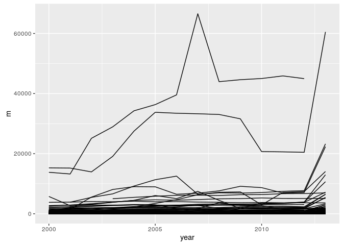
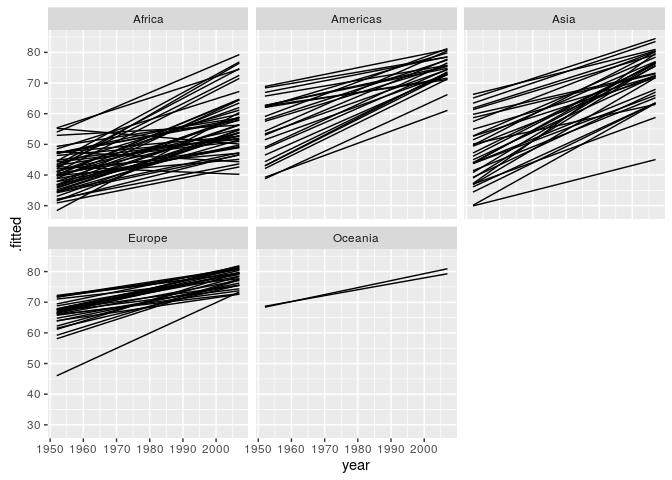
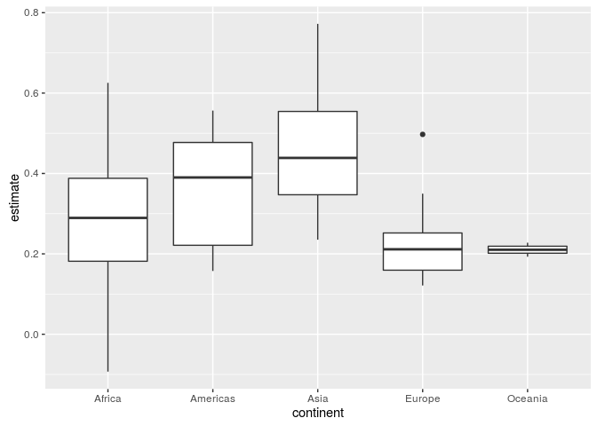

tidyverse
================
Pierre Gestraud

tidyverse
---------

-   `tidyverse` is a suite of packages that follow tidy philosophy
-   initiated by Hadley Wickham

Packages in tidyverse:

-   Core packages: ggplot2, dplyr, tidyr, readr, purrr, tibble
-   Specialized data manipulation: hms, stringr, lubridate, forcats
-   Data import: DBI, haven, httr, jsonlite, readxl, rvest, xml2
-   Modeling: modelr, broom

### Tidy data

-   each variable in the data set is placed in its own column
-   each observation in the data set is placed in its own row
-   each value is placed in its own cell


*Tidy Data, Hadley Wickham, JSS 2014*

### Tidy APIs

Functions should be **consistent** and **readable**

-   Take one step at a time
-   Connect simple steps
-   Consistency
    -   almost all functions take `data.frame` as first argument and return a `data.frame`
    -   all `stringr` functions take string as first argument
-   Runs fast (use `RCPP`)

Data science workflow
---------------------


Data wrangling
--------------


Data import
-----------


-   package `readr`
-   `read_table`, `read_csv`, `read_delim`
-   compared to base functions, `readr` is 10x faster
-   characters are never automatically converted to factors (i.e. no more stringsAsFactors = FALSE!)
-   column names are left
-   row names are never set
-   create tibbles

tibbles
-------

-   package `tibble`
-   new implementation of `data.frame`
-   tibbles are main objects when working with tiydverse

tibbles vs data.frames:

-   print
-   subsetting with `$`: no partial matching, warning if access to non existing column
-   when creating, never change type of input, never change column names, never create rownames

``` r
colnames(who) <- gsub("newrel", "new_rel", colnames(who))
who
```

    ## # A tibble: 7,240 × 60
    ##        country  iso2  iso3  year new_sp_m014 new_sp_m1524 new_sp_m2534
    ##          <chr> <chr> <chr> <int>       <int>        <int>        <int>
    ## 1  Afghanistan    AF   AFG  1980          NA           NA           NA
    ## 2  Afghanistan    AF   AFG  1981          NA           NA           NA
    ## 3  Afghanistan    AF   AFG  1982          NA           NA           NA
    ## 4  Afghanistan    AF   AFG  1983          NA           NA           NA
    ## 5  Afghanistan    AF   AFG  1984          NA           NA           NA
    ## 6  Afghanistan    AF   AFG  1985          NA           NA           NA
    ## 7  Afghanistan    AF   AFG  1986          NA           NA           NA
    ## 8  Afghanistan    AF   AFG  1987          NA           NA           NA
    ## 9  Afghanistan    AF   AFG  1988          NA           NA           NA
    ## 10 Afghanistan    AF   AFG  1989          NA           NA           NA
    ## # ... with 7,230 more rows, and 53 more variables: new_sp_m3544 <int>,
    ## #   new_sp_m4554 <int>, new_sp_m5564 <int>, new_sp_m65 <int>,
    ## #   new_sp_f014 <int>, new_sp_f1524 <int>, new_sp_f2534 <int>,
    ## #   new_sp_f3544 <int>, new_sp_f4554 <int>, new_sp_f5564 <int>,
    ## #   new_sp_f65 <int>, new_sn_m014 <int>, new_sn_m1524 <int>,
    ## #   new_sn_m2534 <int>, new_sn_m3544 <int>, new_sn_m4554 <int>,
    ## #   new_sn_m5564 <int>, new_sn_m65 <int>, new_sn_f014 <int>,
    ## #   new_sn_f1524 <int>, new_sn_f2534 <int>, new_sn_f3544 <int>,
    ## #   new_sn_f4554 <int>, new_sn_f5564 <int>, new_sn_f65 <int>,
    ## #   new_ep_m014 <int>, new_ep_m1524 <int>, new_ep_m2534 <int>,
    ## #   new_ep_m3544 <int>, new_ep_m4554 <int>, new_ep_m5564 <int>,
    ## #   new_ep_m65 <int>, new_ep_f014 <int>, new_ep_f1524 <int>,
    ## #   new_ep_f2534 <int>, new_ep_f3544 <int>, new_ep_f4554 <int>,
    ## #   new_ep_f5564 <int>, new_ep_f65 <int>, new_rel_m014 <int>,
    ## #   new_rel_m1524 <int>, new_rel_m2534 <int>, new_rel_m3544 <int>,
    ## #   new_rel_m4554 <int>, new_rel_m5564 <int>, new_rel_m65 <int>,
    ## #   new_rel_f014 <int>, new_rel_f1524 <int>, new_rel_f2534 <int>,
    ## #   new_rel_f3544 <int>, new_rel_f4554 <int>, new_rel_f5564 <int>,
    ## #   new_rel_f65 <int>

``` r
who$coun
```

    ## Warning: Unknown column 'coun'

    ## NULL

``` r
as.data.frame(who[1:5, ])$coun
```

    ## [1] "Afghanistan" "Afghanistan" "Afghanistan" "Afghanistan" "Afghanistan"

tidyr
-----


-   convert wide data to long (`gather`)
-   convert long data to wide (`spread`)
-   merge variables into one (`unite`)
-   split variable into several (`separate`)
-   replace package `reshape2`


``` r
## wide to long
gather(who)
```

    ## # A tibble: 434,400 × 2
    ##        key       value
    ##      <chr>       <chr>
    ## 1  country Afghanistan
    ## 2  country Afghanistan
    ## 3  country Afghanistan
    ## 4  country Afghanistan
    ## 5  country Afghanistan
    ## 6  country Afghanistan
    ## 7  country Afghanistan
    ## 8  country Afghanistan
    ## 9  country Afghanistan
    ## 10 country Afghanistan
    ## # ... with 434,390 more rows

``` r
who_long <- gather(who, group, cases, -country, -iso2, -iso3, -year)
who_long <- na.omit(who_long)

who_long
```

    ## # A tibble: 76,046 × 6
    ##        country  iso2  iso3  year       group cases
    ##          <chr> <chr> <chr> <int>       <chr> <int>
    ## 1  Afghanistan    AF   AFG  1997 new_sp_m014     0
    ## 2  Afghanistan    AF   AFG  1998 new_sp_m014    30
    ## 3  Afghanistan    AF   AFG  1999 new_sp_m014     8
    ## 4  Afghanistan    AF   AFG  2000 new_sp_m014    52
    ## 5  Afghanistan    AF   AFG  2001 new_sp_m014   129
    ## 6  Afghanistan    AF   AFG  2002 new_sp_m014    90
    ## 7  Afghanistan    AF   AFG  2003 new_sp_m014   127
    ## 8  Afghanistan    AF   AFG  2004 new_sp_m014   139
    ## 9  Afghanistan    AF   AFG  2005 new_sp_m014   151
    ## 10 Afghanistan    AF   AFG  2006 new_sp_m014   193
    ## # ... with 76,036 more rows

``` r
## long to wide
spread(who_long, key = group, value = cases)
```

    ## # A tibble: 3,484 × 60
    ##        country  iso2  iso3  year new_ep_f014 new_ep_f1524 new_ep_f2534
    ## *        <chr> <chr> <chr> <int>       <int>        <int>        <int>
    ## 1  Afghanistan    AF   AFG  1997          NA           NA           NA
    ## 2  Afghanistan    AF   AFG  1998          NA           NA           NA
    ## 3  Afghanistan    AF   AFG  1999          NA           NA           NA
    ## 4  Afghanistan    AF   AFG  2000          NA           NA           NA
    ## 5  Afghanistan    AF   AFG  2001          NA           NA           NA
    ## 6  Afghanistan    AF   AFG  2002          NA           NA           NA
    ## 7  Afghanistan    AF   AFG  2003          NA           NA           NA
    ## 8  Afghanistan    AF   AFG  2004          NA           NA           NA
    ## 9  Afghanistan    AF   AFG  2005          NA           NA           NA
    ## 10 Afghanistan    AF   AFG  2006          NA           NA           NA
    ## # ... with 3,474 more rows, and 53 more variables: new_ep_f3544 <int>,
    ## #   new_ep_f4554 <int>, new_ep_f5564 <int>, new_ep_f65 <int>,
    ## #   new_ep_m014 <int>, new_ep_m1524 <int>, new_ep_m2534 <int>,
    ## #   new_ep_m3544 <int>, new_ep_m4554 <int>, new_ep_m5564 <int>,
    ## #   new_ep_m65 <int>, new_rel_f014 <int>, new_rel_f1524 <int>,
    ## #   new_rel_f2534 <int>, new_rel_f3544 <int>, new_rel_f4554 <int>,
    ## #   new_rel_f5564 <int>, new_rel_f65 <int>, new_rel_m014 <int>,
    ## #   new_rel_m1524 <int>, new_rel_m2534 <int>, new_rel_m3544 <int>,
    ## #   new_rel_m4554 <int>, new_rel_m5564 <int>, new_rel_m65 <int>,
    ## #   new_sn_f014 <int>, new_sn_f1524 <int>, new_sn_f2534 <int>,
    ## #   new_sn_f3544 <int>, new_sn_f4554 <int>, new_sn_f5564 <int>,
    ## #   new_sn_f65 <int>, new_sn_m014 <int>, new_sn_m1524 <int>,
    ## #   new_sn_m2534 <int>, new_sn_m3544 <int>, new_sn_m4554 <int>,
    ## #   new_sn_m5564 <int>, new_sn_m65 <int>, new_sp_f014 <int>,
    ## #   new_sp_f1524 <int>, new_sp_f2534 <int>, new_sp_f3544 <int>,
    ## #   new_sp_f4554 <int>, new_sp_f5564 <int>, new_sp_f65 <int>,
    ## #   new_sp_m014 <int>, new_sp_m1524 <int>, new_sp_m2534 <int>,
    ## #   new_sp_m3544 <int>, new_sp_m4554 <int>, new_sp_m5564 <int>,
    ## #   new_sp_m65 <int>

``` r
## separate
separate(who_long, col = group, sep = "_", into = c("new", "diag", "patient"))
```

    ## # A tibble: 76,046 × 8
    ##        country  iso2  iso3  year   new  diag patient cases
    ## *        <chr> <chr> <chr> <int> <chr> <chr>   <chr> <int>
    ## 1  Afghanistan    AF   AFG  1997   new    sp    m014     0
    ## 2  Afghanistan    AF   AFG  1998   new    sp    m014    30
    ## 3  Afghanistan    AF   AFG  1999   new    sp    m014     8
    ## 4  Afghanistan    AF   AFG  2000   new    sp    m014    52
    ## 5  Afghanistan    AF   AFG  2001   new    sp    m014   129
    ## 6  Afghanistan    AF   AFG  2002   new    sp    m014    90
    ## 7  Afghanistan    AF   AFG  2003   new    sp    m014   127
    ## 8  Afghanistan    AF   AFG  2004   new    sp    m014   139
    ## 9  Afghanistan    AF   AFG  2005   new    sp    m014   151
    ## 10 Afghanistan    AF   AFG  2006   new    sp    m014   193
    ## # ... with 76,036 more rows

``` r
who_long <- separate(who_long, col = group, sep = "_", into = c("new", "diag", "patient"), remove = FALSE)
```

Data manipulation
-----------------


-   package `dplyr`
-   grammar of data manipulation

dplyr
-----

Verbs:

-   `arrange`
-   `filter`
-   `select`
-   `mutate`
-   `transmute`
-   `summarise`
-   `do`

Apply operations by group with `group_by`

Join tables (`full_join`, `right_join`, `left_join`, `inner_join`)

``` r
filter(who_long, year <= 2000)
```

    ## # A tibble: 13,288 × 9
    ##        country  iso2  iso3  year       group   new  diag patient cases
    ##          <chr> <chr> <chr> <int>       <chr> <chr> <chr>   <chr> <int>
    ## 1  Afghanistan    AF   AFG  1997 new_sp_m014   new    sp    m014     0
    ## 2  Afghanistan    AF   AFG  1998 new_sp_m014   new    sp    m014    30
    ## 3  Afghanistan    AF   AFG  1999 new_sp_m014   new    sp    m014     8
    ## 4  Afghanistan    AF   AFG  2000 new_sp_m014   new    sp    m014    52
    ## 5      Albania    AL   ALB  1995 new_sp_m014   new    sp    m014     0
    ## 6      Albania    AL   ALB  1997 new_sp_m014   new    sp    m014     0
    ## 7      Albania    AL   ALB  1998 new_sp_m014   new    sp    m014     1
    ## 8      Albania    AL   ALB  1999 new_sp_m014   new    sp    m014     0
    ## 9      Albania    AL   ALB  2000 new_sp_m014   new    sp    m014     2
    ## 10     Algeria    DZ   DZA  1997 new_sp_m014   new    sp    m014   659
    ## # ... with 13,278 more rows

``` r
filter(who_long, year <= 2000, country == "Afghanistan")
```

    ## # A tibble: 56 × 9
    ##        country  iso2  iso3  year        group   new  diag patient cases
    ##          <chr> <chr> <chr> <int>        <chr> <chr> <chr>   <chr> <int>
    ## 1  Afghanistan    AF   AFG  1997  new_sp_m014   new    sp    m014     0
    ## 2  Afghanistan    AF   AFG  1998  new_sp_m014   new    sp    m014    30
    ## 3  Afghanistan    AF   AFG  1999  new_sp_m014   new    sp    m014     8
    ## 4  Afghanistan    AF   AFG  2000  new_sp_m014   new    sp    m014    52
    ## 5  Afghanistan    AF   AFG  1997 new_sp_m1524   new    sp   m1524    10
    ## 6  Afghanistan    AF   AFG  1998 new_sp_m1524   new    sp   m1524   129
    ## 7  Afghanistan    AF   AFG  1999 new_sp_m1524   new    sp   m1524    55
    ## 8  Afghanistan    AF   AFG  2000 new_sp_m1524   new    sp   m1524   228
    ## 9  Afghanistan    AF   AFG  1997 new_sp_m2534   new    sp   m2534     6
    ## 10 Afghanistan    AF   AFG  1998 new_sp_m2534   new    sp   m2534   128
    ## # ... with 46 more rows

``` r
arrange(who_long, cases)
```

    ## # A tibble: 76,046 × 9
    ##        country  iso2  iso3  year       group   new  diag patient cases
    ##          <chr> <chr> <chr> <int>       <chr> <chr> <chr>   <chr> <int>
    ## 1  Afghanistan    AF   AFG  1997 new_sp_m014   new    sp    m014     0
    ## 2      Albania    AL   ALB  1995 new_sp_m014   new    sp    m014     0
    ## 3      Albania    AL   ALB  1997 new_sp_m014   new    sp    m014     0
    ## 4      Albania    AL   ALB  1999 new_sp_m014   new    sp    m014     0
    ## 5      Albania    AL   ALB  2002 new_sp_m014   new    sp    m014     0
    ## 6      Albania    AL   ALB  2003 new_sp_m014   new    sp    m014     0
    ## 7      Albania    AL   ALB  2005 new_sp_m014   new    sp    m014     0
    ## 8      Albania    AL   ALB  2007 new_sp_m014   new    sp    m014     0
    ## 9      Albania    AL   ALB  2009 new_sp_m014   new    sp    m014     0
    ## 10     Albania    AL   ALB  2010 new_sp_m014   new    sp    m014     0
    ## # ... with 76,036 more rows

``` r
arrange(who_long, desc(cases))
```

    ## # A tibble: 76,046 × 9
    ##    country  iso2  iso3  year         group   new  diag patient  cases
    ##      <chr> <chr> <chr> <int>         <chr> <chr> <chr>   <chr>  <int>
    ## 1    India    IN   IND  2007  new_sn_m3544   new    sn   m3544 250051
    ## 2    India    IN   IND  2007  new_sn_f3544   new    sn   f3544 148811
    ## 3    China    CN   CHN  2013   new_rel_m65   new   rel     m65 124476
    ## 4    China    CN   CHN  2013 new_rel_m5564   new   rel   m5564 112558
    ## 5    India    IN   IND  2007  new_ep_m3544   new    ep   m3544 105825
    ## 6    India    IN   IND  2007  new_ep_f3544   new    ep   f3544 101015
    ## 7    China    CN   CHN  2013 new_rel_m4554   new   rel   m4554 100297
    ## 8    India    IN   IND  2009  new_sp_m3544   new    sp   m3544  90830
    ## 9    India    IN   IND  2008  new_sp_m3544   new    sp   m3544  90498
    ## 10   India    IN   IND  2010  new_sp_m3544   new    sp   m3544  90440
    ## # ... with 76,036 more rows

``` r
select(who_long, country, cases, year)
```

    ## # A tibble: 76,046 × 3
    ##        country cases  year
    ## *        <chr> <int> <int>
    ## 1  Afghanistan     0  1997
    ## 2  Afghanistan    30  1998
    ## 3  Afghanistan     8  1999
    ## 4  Afghanistan    52  2000
    ## 5  Afghanistan   129  2001
    ## 6  Afghanistan    90  2002
    ## 7  Afghanistan   127  2003
    ## 8  Afghanistan   139  2004
    ## 9  Afghanistan   151  2005
    ## 10 Afghanistan   193  2006
    ## # ... with 76,036 more rows

``` r
select(who_long, country, number = cases, year)
```

    ## # A tibble: 76,046 × 3
    ##        country number  year
    ## *        <chr>  <int> <int>
    ## 1  Afghanistan      0  1997
    ## 2  Afghanistan     30  1998
    ## 3  Afghanistan      8  1999
    ## 4  Afghanistan     52  2000
    ## 5  Afghanistan    129  2001
    ## 6  Afghanistan     90  2002
    ## 7  Afghanistan    127  2003
    ## 8  Afghanistan    139  2004
    ## 9  Afghanistan    151  2005
    ## 10 Afghanistan    193  2006
    ## # ... with 76,036 more rows

``` r
select(who_long, -group)
```

    ## # A tibble: 76,046 × 8
    ##        country  iso2  iso3  year   new  diag patient cases
    ## *        <chr> <chr> <chr> <int> <chr> <chr>   <chr> <int>
    ## 1  Afghanistan    AF   AFG  1997   new    sp    m014     0
    ## 2  Afghanistan    AF   AFG  1998   new    sp    m014    30
    ## 3  Afghanistan    AF   AFG  1999   new    sp    m014     8
    ## 4  Afghanistan    AF   AFG  2000   new    sp    m014    52
    ## 5  Afghanistan    AF   AFG  2001   new    sp    m014   129
    ## 6  Afghanistan    AF   AFG  2002   new    sp    m014    90
    ## 7  Afghanistan    AF   AFG  2003   new    sp    m014   127
    ## 8  Afghanistan    AF   AFG  2004   new    sp    m014   139
    ## 9  Afghanistan    AF   AFG  2005   new    sp    m014   151
    ## 10 Afghanistan    AF   AFG  2006   new    sp    m014   193
    ## # ... with 76,036 more rows

``` r
select(who_long, starts_with("p"))
```

    ## # A tibble: 76,046 × 1
    ##    patient
    ## *    <chr>
    ## 1     m014
    ## 2     m014
    ## 3     m014
    ## 4     m014
    ## 5     m014
    ## 6     m014
    ## 7     m014
    ## 8     m014
    ## 9     m014
    ## 10    m014
    ## # ... with 76,036 more rows

``` r
mutate(who_long, log_cases = log(1 + cases), cases2 = exp(log_cases) - 1)
```

    ## # A tibble: 76,046 × 11
    ##        country  iso2  iso3  year       group   new  diag patient cases
    ##          <chr> <chr> <chr> <int>       <chr> <chr> <chr>   <chr> <int>
    ## 1  Afghanistan    AF   AFG  1997 new_sp_m014   new    sp    m014     0
    ## 2  Afghanistan    AF   AFG  1998 new_sp_m014   new    sp    m014    30
    ## 3  Afghanistan    AF   AFG  1999 new_sp_m014   new    sp    m014     8
    ## 4  Afghanistan    AF   AFG  2000 new_sp_m014   new    sp    m014    52
    ## 5  Afghanistan    AF   AFG  2001 new_sp_m014   new    sp    m014   129
    ## 6  Afghanistan    AF   AFG  2002 new_sp_m014   new    sp    m014    90
    ## 7  Afghanistan    AF   AFG  2003 new_sp_m014   new    sp    m014   127
    ## 8  Afghanistan    AF   AFG  2004 new_sp_m014   new    sp    m014   139
    ## 9  Afghanistan    AF   AFG  2005 new_sp_m014   new    sp    m014   151
    ## 10 Afghanistan    AF   AFG  2006 new_sp_m014   new    sp    m014   193
    ## # ... with 76,036 more rows, and 2 more variables: log_cases <dbl>,
    ## #   cases2 <dbl>

``` r
summarise(who_long, m = mean(cases))
```

    ## # A tibble: 1 × 1
    ##          m
    ##      <dbl>
    ## 1 570.6746

``` r
who_long <- mutate(who_long, gender = substr(patient, 1, 1))


who_long_by_country <- group_by(who_long, country)
summarise(who_long_by_country, m = mean(cases))
```

    ## # A tibble: 219 × 2
    ##                country            m
    ##                  <chr>        <dbl>
    ## 1          Afghanistan 5.746926e+02
    ## 2              Albania 1.190848e+01
    ## 3              Algeria 5.719598e+02
    ## 4       American Samoa 2.383721e-01
    ## 5              Andorra 2.661499e-01
    ## 6               Angola 1.142093e+03
    ## 7             Anguilla 1.290323e-02
    ## 8  Antigua and Barbuda 1.589595e-01
    ## 9            Argentina 2.615089e+02
    ## 10             Armenia 3.468764e+01
    ## # ... with 209 more rows

``` r
summarise(who_long_by_country, m = mean(cases), number = n())
```

    ## # A tibble: 219 × 3
    ##                country            m number
    ##                  <chr>        <dbl>  <int>
    ## 1          Afghanistan 5.746926e+02    244
    ## 2              Albania 1.190848e+01    448
    ## 3              Algeria 5.719598e+02    224
    ## 4       American Samoa 2.383721e-01    172
    ## 5              Andorra 2.661499e-01    387
    ## 6               Angola 1.142093e+03    270
    ## 7             Anguilla 1.290323e-02    155
    ## 8  Antigua and Barbuda 1.589595e-01    346
    ## 9            Argentina 2.615089e+02    448
    ## 10             Armenia 3.468764e+01    461
    ## # ... with 209 more rows

``` r
summarise(who_long_by_country, m = mean(cases), log_mean = log(m))
```

    ## # A tibble: 219 × 3
    ##                country            m  log_mean
    ##                  <chr>        <dbl>     <dbl>
    ## 1          Afghanistan 5.746926e+02  6.353835
    ## 2              Albania 1.190848e+01  2.477251
    ## 3              Algeria 5.719598e+02  6.349069
    ## 4       American Samoa 2.383721e-01 -1.433922
    ## 5              Andorra 2.661499e-01 -1.323696
    ## 6               Angola 1.142093e+03  7.040617
    ## 7             Anguilla 1.290323e-02 -4.350278
    ## 8  Antigua and Barbuda 1.589595e-01 -1.839106
    ## 9            Argentina 2.615089e+02  5.566468
    ## 10             Armenia 3.468764e+01  3.546383
    ## # ... with 209 more rows

``` r
who_long_by_country_gender <- group_by(who_long, country, gender)
summarise(who_long_by_country_gender, m = mean(cases))
```

    ## Source: local data frame [438 x 3]
    ## Groups: country [?]
    ## 
    ##           country gender           m
    ##             <chr>  <chr>       <dbl>
    ## 1     Afghanistan      f 811.7739130
    ## 2     Afghanistan      m 363.3410853
    ## 3         Albania      f   8.1696429
    ## 4         Albania      m  15.6473214
    ## 5         Algeria      f 451.0892857
    ## 6         Algeria      m 692.8303571
    ## 7  American Samoa      f   0.2386364
    ## 8  American Samoa      m   0.2380952
    ## 9         Andorra      f   0.2204301
    ## 10        Andorra      m   0.3084577
    ## # ... with 428 more rows

magrittr
--------

"Ceci n'est pas un pipe"


-   `magrittr` introduce new pipe operator: `%>%`
-   makes code more readable
-   provides aliases (`extract`, `add`, `equals`, `set_colnames`...)


``` r
who_long %>% group_by(country) %>% summarise(number = n(), m = mean(cases))
```

    ## # A tibble: 219 × 3
    ##                country number            m
    ##                  <chr>  <int>        <dbl>
    ## 1          Afghanistan    244 5.746926e+02
    ## 2              Albania    448 1.190848e+01
    ## 3              Algeria    224 5.719598e+02
    ## 4       American Samoa    172 2.383721e-01
    ## 5              Andorra    387 2.661499e-01
    ## 6               Angola    270 1.142093e+03
    ## 7             Anguilla    155 1.290323e-02
    ## 8  Antigua and Barbuda    346 1.589595e-01
    ## 9            Argentina    448 2.615089e+02
    ## 10             Armenia    461 3.468764e+01
    ## # ... with 209 more rows

``` r
## summarise(group_by(who_long, country), number = n(), m = mean(cases))
who_long %>% 
    filter(year <= 2000) %>% 
    group_by(country) %>% 
    summarise(number = n(), m = mean(cases))
```

    ## # A tibble: 202 × 3
    ##                country number           m
    ##                  <chr>  <int>       <dbl>
    ## 1          Afghanistan     56  94.9464286
    ## 2              Albania     70  13.3000000
    ## 3              Algeria     42 572.3809524
    ## 4       American Samoa     17   0.5294118
    ## 5              Andorra     56   0.5714286
    ## 6               Angola     84 541.9285714
    ## 7  Antigua and Barbuda     28   0.2142857
    ## 8            Argentina     70 363.6285714
    ## 9              Armenia     83  29.8433735
    ## 10           Australia     56  16.9285714
    ## # ... with 192 more rows

-   `magrittr` gives to LHS function the result of RHS as first argument
-   use `.` to put RHS result somewhere else

``` r
who_long %>% lm(cases ~ gender, data = .)
```

    ## 
    ## Call:
    ## lm(formula = cases ~ gender, data = .)
    ## 
    ## Coefficients:
    ## (Intercept)      genderm  
    ##       419.2        302.4

purrr
-----

-   `purrr` works on lists
-   family of `map` functions replace `apply`
-   control over output type

``` r
iris %>% select(-Species) %>% map(mean)
```

    ## $Sepal.Length
    ## [1] 5.843333
    ## 
    ## $Sepal.Width
    ## [1] 3.057333
    ## 
    ## $Petal.Length
    ## [1] 3.758
    ## 
    ## $Petal.Width
    ## [1] 1.199333

``` r
iris %>% select(-Species) %>% map_df(mean)
```

    ## # A tibble: 1 × 4
    ##   Sepal.Length Sepal.Width Petal.Length Petal.Width
    ##          <dbl>       <dbl>        <dbl>       <dbl>
    ## 1     5.843333    3.057333        3.758    1.199333

``` r
iris %>% select(-Species) %>% map_dbl(mean)
```

    ## Sepal.Length  Sepal.Width Petal.Length  Petal.Width 
    ##     5.843333     3.057333     3.758000     1.199333

``` r
iris %>% map_if(is.numeric, mean)
```

    ## $Sepal.Length
    ## [1] 5.843333
    ## 
    ## $Sepal.Width
    ## [1] 3.057333
    ## 
    ## $Petal.Length
    ## [1] 3.758
    ## 
    ## $Petal.Width
    ## [1] 1.199333
    ## 
    ## $Species
    ##   [1] setosa     setosa     setosa     setosa     setosa     setosa    
    ##   [7] setosa     setosa     setosa     setosa     setosa     setosa    
    ##  [13] setosa     setosa     setosa     setosa     setosa     setosa    
    ##  [19] setosa     setosa     setosa     setosa     setosa     setosa    
    ##  [25] setosa     setosa     setosa     setosa     setosa     setosa    
    ##  [31] setosa     setosa     setosa     setosa     setosa     setosa    
    ##  [37] setosa     setosa     setosa     setosa     setosa     setosa    
    ##  [43] setosa     setosa     setosa     setosa     setosa     setosa    
    ##  [49] setosa     setosa     versicolor versicolor versicolor versicolor
    ##  [55] versicolor versicolor versicolor versicolor versicolor versicolor
    ##  [61] versicolor versicolor versicolor versicolor versicolor versicolor
    ##  [67] versicolor versicolor versicolor versicolor versicolor versicolor
    ##  [73] versicolor versicolor versicolor versicolor versicolor versicolor
    ##  [79] versicolor versicolor versicolor versicolor versicolor versicolor
    ##  [85] versicolor versicolor versicolor versicolor versicolor versicolor
    ##  [91] versicolor versicolor versicolor versicolor versicolor versicolor
    ##  [97] versicolor versicolor versicolor versicolor virginica  virginica 
    ## [103] virginica  virginica  virginica  virginica  virginica  virginica 
    ## [109] virginica  virginica  virginica  virginica  virginica  virginica 
    ## [115] virginica  virginica  virginica  virginica  virginica  virginica 
    ## [121] virginica  virginica  virginica  virginica  virginica  virginica 
    ## [127] virginica  virginica  virginica  virginica  virginica  virginica 
    ## [133] virginica  virginica  virginica  virginica  virginica  virginica 
    ## [139] virginica  virginica  virginica  virginica  virginica  virginica 
    ## [145] virginica  virginica  virginica  virginica  virginica  virginica 
    ## Levels: setosa versicolor virginica

-   `flatten`
-   `transpose`

Data visualisation
------------------

-   `ggplot2`
-   perfectly integrated in workflow

``` r
who_long %>% 
    filter(year >= 2000) %>% 
    group_by(country, year) %>% 
    summarise(m = mean(cases)) %>% 
    ggplot(aes(x = year, y = m, group = country)) + geom_line()
```



Model
-----


broom
-----


-   `broom` makes tidy data from models
-   `glance`: model summary
-   `tidy`: information about coefficients
-   `augment`: information about observations
-   support for large number of models (`lm`, `glm`, `lme4`, `gam`, `anova`, `nls`, `kmeans`, `arima`...)

``` r
mod <- lm(Sepal.Length ~ Petal.Length, data = iris)
glance(mod)
```

    ##   r.squared adj.r.squared     sigma statistic      p.value df    logLik
    ## 1 0.7599546     0.7583327 0.4070745  468.5502 1.038667e-47  2 -77.02021
    ##        AIC      BIC deviance df.residual
    ## 1 160.0404 169.0723 24.52503         148

``` r
tidy(mod)
```

    ##           term  estimate  std.error statistic       p.value
    ## 1  (Intercept) 4.3066034 0.07838896  54.93890 2.426713e-100
    ## 2 Petal.Length 0.4089223 0.01889134  21.64602  1.038667e-47

``` r
augment(mod) %>% head
```

    ##   Sepal.Length Petal.Length  .fitted    .se.fit     .resid       .hat
    ## 1          5.1          1.4 4.879095 0.05557929  0.2209054 0.01864138
    ## 2          4.9          1.4 4.879095 0.05557929  0.0209054 0.01864138
    ## 3          4.7          1.3 4.838202 0.05710457 -0.1382024 0.01967858
    ## 4          4.6          1.5 4.919987 0.05407699 -0.3199868 0.01764725
    ## 5          5.0          1.4 4.879095 0.05557929  0.1209054 0.01864138
    ## 6          5.4          1.7 5.001771 0.05114938  0.3982287 0.01578821
    ##      .sigma      .cooksd  .std.resid
    ## 1 0.4080425 2.850082e-03  0.54779556
    ## 2 0.4084531 2.552475e-05  0.05184067
    ## 3 0.4082945 1.180076e-03 -0.34289197
    ## 4 0.4075879 5.649740e-03 -0.79309356
    ## 5 0.4083327 8.537605e-04  0.29981811
    ## 6 0.4071128 7.799073e-03  0.98608497

And for bioinformatics? Use `biobroom`! (<https://www.bioconductor.org/packages/release/bioc/html/biobroom.html>)

modelr
------

-   package `modelr` to work with models and data.frame
-   `add_predictions`
-   `add_residuals`

``` r
iris %>% add_residuals(mod) %>% add_predictions(mod) %>% head
```

    ##   Sepal.Length Sepal.Width Petal.Length Petal.Width Species      resid
    ## 1          5.1         3.5          1.4         0.2  setosa  0.2209054
    ## 2          4.9         3.0          1.4         0.2  setosa  0.0209054
    ## 3          4.7         3.2          1.3         0.2  setosa -0.1382024
    ## 4          4.6         3.1          1.5         0.2  setosa -0.3199868
    ## 5          5.0         3.6          1.4         0.2  setosa  0.1209054
    ## 6          5.4         3.9          1.7         0.4  setosa  0.3982287
    ##       pred
    ## 1 4.879095
    ## 2 4.879095
    ## 3 4.838202
    ## 4 4.919987
    ## 5 4.879095
    ## 6 5.001771

Many models
-----------

-   create a nested data.frame

``` r
gap_by_country <- gapminder %>% 
    group_by(country, continent) %>% 
    nest
```

-   column data is a `list`

-   compute model for each country

``` r
gap_by_country <- gap_by_country %>% mutate(mod = map(data, ~lm(lifeExp ~ year, data = .)))
```

-   models and data are stored together

-   now add information about model

``` r
gap_by_country %>% 
    mutate(glance = map(mod, glance)) %>% 
    unnest(glance) %>% 
    arrange(r.squared)
```

    ## # A tibble: 142 × 15
    ##             country continent              data      mod  r.squared
    ##              <fctr>    <fctr>            <list>   <list>      <dbl>
    ## 1            Rwanda    Africa <tibble [12 × 4]> <S3: lm> 0.01715964
    ## 2          Botswana    Africa <tibble [12 × 4]> <S3: lm> 0.03402340
    ## 3          Zimbabwe    Africa <tibble [12 × 4]> <S3: lm> 0.05623196
    ## 4            Zambia    Africa <tibble [12 × 4]> <S3: lm> 0.05983644
    ## 5         Swaziland    Africa <tibble [12 × 4]> <S3: lm> 0.06821087
    ## 6           Lesotho    Africa <tibble [12 × 4]> <S3: lm> 0.08485635
    ## 7     Cote d'Ivoire    Africa <tibble [12 × 4]> <S3: lm> 0.28337240
    ## 8      South Africa    Africa <tibble [12 × 4]> <S3: lm> 0.31246865
    ## 9            Uganda    Africa <tibble [12 × 4]> <S3: lm> 0.34215382
    ## 10 Congo, Dem. Rep.    Africa <tibble [12 × 4]> <S3: lm> 0.34820278
    ## # ... with 132 more rows, and 10 more variables: adj.r.squared <dbl>,
    ## #   sigma <dbl>, statistic <dbl>, p.value <dbl>, df <int>, logLik <dbl>,
    ## #   AIC <dbl>, BIC <dbl>, deviance <dbl>, df.residual <int>

``` r
## find bad quality models
gap_by_country %>% 
    mutate(glance = map(mod, glance)) %>% 
    unnest(glance) %>% 
    filter(r.squared <= 0.1)
```

    ## # A tibble: 6 × 15
    ##     country continent              data      mod  r.squared adj.r.squared
    ##      <fctr>    <fctr>            <list>   <list>      <dbl>         <dbl>
    ## 1  Botswana    Africa <tibble [12 × 4]> <S3: lm> 0.03402340  -0.062574259
    ## 2   Lesotho    Africa <tibble [12 × 4]> <S3: lm> 0.08485635  -0.006658011
    ## 3    Rwanda    Africa <tibble [12 × 4]> <S3: lm> 0.01715964  -0.081124401
    ## 4 Swaziland    Africa <tibble [12 × 4]> <S3: lm> 0.06821087  -0.024968046
    ## 5    Zambia    Africa <tibble [12 × 4]> <S3: lm> 0.05983644  -0.034179918
    ## 6  Zimbabwe    Africa <tibble [12 × 4]> <S3: lm> 0.05623196  -0.038144842
    ## # ... with 9 more variables: sigma <dbl>, statistic <dbl>, p.value <dbl>,
    ## #   df <int>, logLik <dbl>, AIC <dbl>, BIC <dbl>, deviance <dbl>,
    ## #   df.residual <int>

``` r
gap_by_country %>% 
    mutate(augment = map(mod, augment)) %>% 
    unnest(augment) %>% 
    ggplot(aes(x = year, y = .fitted, group = country)) + geom_line() + facet_wrap(~continent)
```



``` r
gap_by_country %>% 
    mutate(tidy = map(mod, tidy)) %>% 
    unnest(tidy) %>% 
    filter(term == "year") %>% 
    ggplot(aes(x = continent, y = estimate)) + geom_boxplot()
```



Data type specific packages
---------------------------

Strings
-------


-   package `stringr`
-   enhances base functions for strings manipulations
-   functions `str_`\*

Dates
-----


-   package `lubridate`
-   enhances base functions for dates and times manipulations
-   `ymd`, `year`, `month`, `day`, `round_date`, `floor_date`

Factors
-------


-   package `forcats`
-   change levels, order...

A package to rule them all
--------------------------

-   package `tidyverse`
-   install all packages of tidyverse
-   when loaded, attach only some packages

Ressources
----------

-   R4ds (<http://r4ds.had.co.nz/>)
-   rstudio cheatsheet
