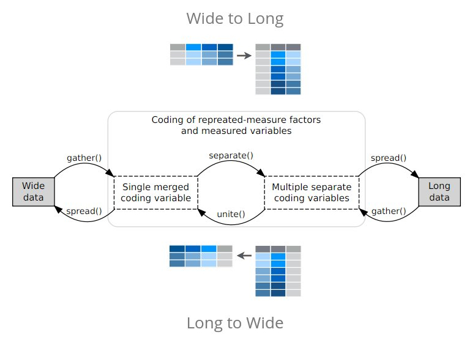

# tidyverse
Pierre Gestraud  


# tidyverse

* `tidyverse` is a suite of packages that follow tidy philosophy
* initiated by Hadley Wickham
* http://tidyverse.org/

Packages in tidyverse:

- Core packages: `ggplot2`, `dplyr`, `tidyr`, `readr`, `purrr`, `tibble`
- Specialized data manipulation: `hms`, `stringr`, `lubridate`, `forcats`
- Data import: `DBI`, `feather`, `haven`, `httr`, `jsonlite`, `readxl`, `rvest`, `xml2`
- Modeling: `modelr`, `broom`

Warning: tidyverse function use mainly NSE (unquoted expressions)

## Tidy data

* each variable in the data set is placed in its own column
* each observation in the data set is placed in its own row
* each value is placed in its own cell


*Tidy Data, Hadley Wickham, JSS 2014*

## Tidy APIs

Functions should be **consistent** and  **readable**

- Take one step at a time
- Connect simple steps
- Consistency
    * almost all functions take `data.frame` as first argument and return a `data.frame`
    * all `stringr` functions take string as first argument
- Runs fast (use `RCPP`)    


# Data science workflow


# Data wrangling


## Data import


* package `readr`
* `read_table`, `read_csv`, `read_delim`...
* compared to base functions, `readr` is much faster
* characters are never automatically converted to factors (i.e. no more stringsAsFactors = FALSE!)
* column names are left
* row names are never set
* create tibbles


```r
## write temporary file
tmp <- tempfile()
invisible(replicate(100,write.table(gapminder, file = tmp, append = TRUE, sep="\t", col.names = FALSE)))
```


```r
require(microbenchmark)
```

```
Loading required package: microbenchmark
```

```r
microbenchmark(base = read.table(tmp, sep="\t"), readr =  suppressMessages(read_delim(tmp, delim="\t", progress = FALSE)))
```

```
Unit: milliseconds
  expr      min       lq     mean   median       uq      max neval cld
  base 545.5896 613.6904 633.1348 622.5000 656.1659 711.6905   100   b
 readr 159.1569 166.2486 201.6124 218.1589 226.7426 398.5895   100  a 
```


## tibbles

* main objects when working with tiydverse 
* package `tibble`
* new implementation of `data.frame`


tibbles vs data.frames:

* print
* subsetting with `$`: no partial matching, warning if access to non-existing column
* when creating, never change type of input, never change column names, never create rownames


```r
colnames(who) <- gsub("newrel", "new_rel", colnames(who))
who
```

```
# A tibble: 7,240 x 60
       country  iso2  iso3  year new_sp_m014 new_sp_m1524 new_sp_m2534
         <chr> <chr> <chr> <int>       <int>        <int>        <int>
 1 Afghanistan    AF   AFG  1980          NA           NA           NA
 2 Afghanistan    AF   AFG  1981          NA           NA           NA
 3 Afghanistan    AF   AFG  1982          NA           NA           NA
 4 Afghanistan    AF   AFG  1983          NA           NA           NA
 5 Afghanistan    AF   AFG  1984          NA           NA           NA
 6 Afghanistan    AF   AFG  1985          NA           NA           NA
 7 Afghanistan    AF   AFG  1986          NA           NA           NA
 8 Afghanistan    AF   AFG  1987          NA           NA           NA
 9 Afghanistan    AF   AFG  1988          NA           NA           NA
10 Afghanistan    AF   AFG  1989          NA           NA           NA
# ... with 7,230 more rows, and 53 more variables: new_sp_m3544 <int>,
#   new_sp_m4554 <int>, new_sp_m5564 <int>, new_sp_m65 <int>,
#   new_sp_f014 <int>, new_sp_f1524 <int>, new_sp_f2534 <int>,
#   new_sp_f3544 <int>, new_sp_f4554 <int>, new_sp_f5564 <int>,
#   new_sp_f65 <int>, new_sn_m014 <int>, new_sn_m1524 <int>,
#   new_sn_m2534 <int>, new_sn_m3544 <int>, new_sn_m4554 <int>,
#   new_sn_m5564 <int>, new_sn_m65 <int>, new_sn_f014 <int>,
#   new_sn_f1524 <int>, new_sn_f2534 <int>, new_sn_f3544 <int>,
#   new_sn_f4554 <int>, new_sn_f5564 <int>, new_sn_f65 <int>,
#   new_ep_m014 <int>, new_ep_m1524 <int>, new_ep_m2534 <int>,
#   new_ep_m3544 <int>, new_ep_m4554 <int>, new_ep_m5564 <int>,
#   new_ep_m65 <int>, new_ep_f014 <int>, new_ep_f1524 <int>,
#   new_ep_f2534 <int>, new_ep_f3544 <int>, new_ep_f4554 <int>,
#   new_ep_f5564 <int>, new_ep_f65 <int>, new_rel_m014 <int>,
#   new_rel_m1524 <int>, new_rel_m2534 <int>, new_rel_m3544 <int>,
#   new_rel_m4554 <int>, new_rel_m5564 <int>, new_rel_m65 <int>,
#   new_rel_f014 <int>, new_rel_f1524 <int>, new_rel_f2534 <int>,
#   new_rel_f3544 <int>, new_rel_f4554 <int>, new_rel_f5564 <int>,
#   new_rel_f65 <int>
```

```r
who$coun
```

```
Warning: Unknown or uninitialised column: 'coun'.
```

```
NULL
```

```r
head(as.data.frame(who)$coun)
```

```
[1] "Afghanistan" "Afghanistan" "Afghanistan" "Afghanistan" "Afghanistan"
[6] "Afghanistan"
```

To preserve rownames, convert them to an explicit variable with `rownames_to_column`


```r
d <- data.frame(x = c("A", "B"), row.names = c("p1", "p2"))
d
```

```
   x
p1 A
p2 B
```

```r
as.tibble(d) 
```

```
# A tibble: 2 x 1
       x
* <fctr>
1      A
2      B
```

```r
rownames_to_column(d)
```

```
  rowname x
1      p1 A
2      p2 B
```


## tidyr


Help you to create **tidy data**.

* replace package `reshape2`
* convert wide data to long (`gather`)
* convert long data to wide (`spread`)
* merge variables into one (`unite`)
* split variable into several (`separate`)
* `nest`/`unnest` 
* `expand`, `crossing`, `nesting`




```r
## wide to long
gather(who)
```

```
# A tibble: 434,400 x 2
       key       value
     <chr>       <chr>
 1 country Afghanistan
 2 country Afghanistan
 3 country Afghanistan
 4 country Afghanistan
 5 country Afghanistan
 6 country Afghanistan
 7 country Afghanistan
 8 country Afghanistan
 9 country Afghanistan
10 country Afghanistan
# ... with 434,390 more rows
```

```r
who_long <- gather(who, group, cases, -country, -iso2, -iso3, -year)
who_long <- na.omit(who_long)

who_long
```

```
# A tibble: 76,046 x 6
       country  iso2  iso3  year       group cases
         <chr> <chr> <chr> <int>       <chr> <int>
 1 Afghanistan    AF   AFG  1997 new_sp_m014     0
 2 Afghanistan    AF   AFG  1998 new_sp_m014    30
 3 Afghanistan    AF   AFG  1999 new_sp_m014     8
 4 Afghanistan    AF   AFG  2000 new_sp_m014    52
 5 Afghanistan    AF   AFG  2001 new_sp_m014   129
 6 Afghanistan    AF   AFG  2002 new_sp_m014    90
 7 Afghanistan    AF   AFG  2003 new_sp_m014   127
 8 Afghanistan    AF   AFG  2004 new_sp_m014   139
 9 Afghanistan    AF   AFG  2005 new_sp_m014   151
10 Afghanistan    AF   AFG  2006 new_sp_m014   193
# ... with 76,036 more rows
```

```r
## long to wide
spread(who_long, key = group, value = cases)
```

```
# A tibble: 3,484 x 60
       country  iso2  iso3  year new_ep_f014 new_ep_f1524 new_ep_f2534
 *       <chr> <chr> <chr> <int>       <int>        <int>        <int>
 1 Afghanistan    AF   AFG  1997          NA           NA           NA
 2 Afghanistan    AF   AFG  1998          NA           NA           NA
 3 Afghanistan    AF   AFG  1999          NA           NA           NA
 4 Afghanistan    AF   AFG  2000          NA           NA           NA
 5 Afghanistan    AF   AFG  2001          NA           NA           NA
 6 Afghanistan    AF   AFG  2002          NA           NA           NA
 7 Afghanistan    AF   AFG  2003          NA           NA           NA
 8 Afghanistan    AF   AFG  2004          NA           NA           NA
 9 Afghanistan    AF   AFG  2005          NA           NA           NA
10 Afghanistan    AF   AFG  2006          NA           NA           NA
# ... with 3,474 more rows, and 53 more variables: new_ep_f3544 <int>,
#   new_ep_f4554 <int>, new_ep_f5564 <int>, new_ep_f65 <int>,
#   new_ep_m014 <int>, new_ep_m1524 <int>, new_ep_m2534 <int>,
#   new_ep_m3544 <int>, new_ep_m4554 <int>, new_ep_m5564 <int>,
#   new_ep_m65 <int>, new_rel_f014 <int>, new_rel_f1524 <int>,
#   new_rel_f2534 <int>, new_rel_f3544 <int>, new_rel_f4554 <int>,
#   new_rel_f5564 <int>, new_rel_f65 <int>, new_rel_m014 <int>,
#   new_rel_m1524 <int>, new_rel_m2534 <int>, new_rel_m3544 <int>,
#   new_rel_m4554 <int>, new_rel_m5564 <int>, new_rel_m65 <int>,
#   new_sn_f014 <int>, new_sn_f1524 <int>, new_sn_f2534 <int>,
#   new_sn_f3544 <int>, new_sn_f4554 <int>, new_sn_f5564 <int>,
#   new_sn_f65 <int>, new_sn_m014 <int>, new_sn_m1524 <int>,
#   new_sn_m2534 <int>, new_sn_m3544 <int>, new_sn_m4554 <int>,
#   new_sn_m5564 <int>, new_sn_m65 <int>, new_sp_f014 <int>,
#   new_sp_f1524 <int>, new_sp_f2534 <int>, new_sp_f3544 <int>,
#   new_sp_f4554 <int>, new_sp_f5564 <int>, new_sp_f65 <int>,
#   new_sp_m014 <int>, new_sp_m1524 <int>, new_sp_m2534 <int>,
#   new_sp_m3544 <int>, new_sp_m4554 <int>, new_sp_m5564 <int>,
#   new_sp_m65 <int>
```

```r
## separate
separate(who_long, col = group, sep = "_", into = c("new", "diag", "patient"))
```

```
# A tibble: 76,046 x 8
       country  iso2  iso3  year   new  diag patient cases
 *       <chr> <chr> <chr> <int> <chr> <chr>   <chr> <int>
 1 Afghanistan    AF   AFG  1997   new    sp    m014     0
 2 Afghanistan    AF   AFG  1998   new    sp    m014    30
 3 Afghanistan    AF   AFG  1999   new    sp    m014     8
 4 Afghanistan    AF   AFG  2000   new    sp    m014    52
 5 Afghanistan    AF   AFG  2001   new    sp    m014   129
 6 Afghanistan    AF   AFG  2002   new    sp    m014    90
 7 Afghanistan    AF   AFG  2003   new    sp    m014   127
 8 Afghanistan    AF   AFG  2004   new    sp    m014   139
 9 Afghanistan    AF   AFG  2005   new    sp    m014   151
10 Afghanistan    AF   AFG  2006   new    sp    m014   193
# ... with 76,036 more rows
```

```r
who_long <- separate(who_long, col = group, sep = "_", into = c("new", "diag", "patient"), remove = FALSE)
```


## Data manipulation - dplyr


- package `dplyr`
- implements grammar of data manipulation

Single table verbs: 

* `arrange`
* `filter`
* `select`
* `mutate`
* `transmute`
* `summarise`

Apply operations by group with `group_by`.

Two-table verbs:

* Join tables (`full_join`, `right_join`, `left_join`, `inner_join`, `anti_join`)

### Single table verbs

#### Sort table rows with arrange


Sort rows according to **one variable**.


```r
arrange(who_long, cases)
```

```
# A tibble: 76,046 x 9
       country  iso2  iso3  year       group   new  diag patient cases
         <chr> <chr> <chr> <int>       <chr> <chr> <chr>   <chr> <int>
 1 Afghanistan    AF   AFG  1997 new_sp_m014   new    sp    m014     0
 2     Albania    AL   ALB  1995 new_sp_m014   new    sp    m014     0
 3     Albania    AL   ALB  1997 new_sp_m014   new    sp    m014     0
 4     Albania    AL   ALB  1999 new_sp_m014   new    sp    m014     0
 5     Albania    AL   ALB  2002 new_sp_m014   new    sp    m014     0
 6     Albania    AL   ALB  2003 new_sp_m014   new    sp    m014     0
 7     Albania    AL   ALB  2005 new_sp_m014   new    sp    m014     0
 8     Albania    AL   ALB  2007 new_sp_m014   new    sp    m014     0
 9     Albania    AL   ALB  2009 new_sp_m014   new    sp    m014     0
10     Albania    AL   ALB  2010 new_sp_m014   new    sp    m014     0
# ... with 76,036 more rows
```

Sort rows according to **several variables**. Sorting variables are separated by a comma, order of variables matters.


```r
arrange(who_long, cases, year)
```

```
# A tibble: 76,046 x 9
        country  iso2  iso3  year        group   new  diag patient cases
          <chr> <chr> <chr> <int>        <chr> <chr> <chr>   <chr> <int>
 1 Cook Islands    CK   COK  1980  new_sp_m014   new    sp    m014     0
 2 Cook Islands    CK   COK  1980 new_sp_m2534   new    sp   m2534     0
 3 Cook Islands    CK   COK  1980 new_sp_m5564   new    sp   m5564     0
 4 Cook Islands    CK   COK  1980   new_sp_m65   new    sp     m65     0
 5 Cook Islands    CK   COK  1980  new_sp_f014   new    sp    f014     0
 6 Cook Islands    CK   COK  1980 new_sp_f2534   new    sp   f2534     0
 7 Cook Islands    CK   COK  1980 new_sp_f3544   new    sp   f3544     0
 8 Cook Islands    CK   COK  1980 new_sp_f5564   new    sp   f5564     0
 9 Cook Islands    CK   COK  1980   new_sp_f65   new    sp     f65     0
10 Cook Islands    CK   COK  1981  new_sp_m014   new    sp    m014     0
# ... with 76,036 more rows
```

```r
arrange(who_long, year, cases)
```

```
# A tibble: 76,046 x 9
        country  iso2  iso3  year        group   new  diag patient cases
          <chr> <chr> <chr> <int>        <chr> <chr> <chr>   <chr> <int>
 1 Cook Islands    CK   COK  1980  new_sp_m014   new    sp    m014     0
 2 Cook Islands    CK   COK  1980 new_sp_m2534   new    sp   m2534     0
 3 Cook Islands    CK   COK  1980 new_sp_m5564   new    sp   m5564     0
 4 Cook Islands    CK   COK  1980   new_sp_m65   new    sp     m65     0
 5 Cook Islands    CK   COK  1980  new_sp_f014   new    sp    f014     0
 6 Cook Islands    CK   COK  1980 new_sp_f2534   new    sp   f2534     0
 7 Cook Islands    CK   COK  1980 new_sp_f3544   new    sp   f3544     0
 8 Cook Islands    CK   COK  1980 new_sp_f5564   new    sp   f5564     0
 9 Cook Islands    CK   COK  1980   new_sp_f65   new    sp     f65     0
10 Cook Islands    CK   COK  1980 new_sp_m3544   new    sp   m3544     1
# ... with 76,036 more rows
```

To sort rows in **decreasing** order, use `desc`.


```r
arrange(who_long, desc(cases), year)
```

```
# A tibble: 76,046 x 9
   country  iso2  iso3  year         group   new  diag patient  cases
     <chr> <chr> <chr> <int>         <chr> <chr> <chr>   <chr>  <int>
 1   India    IN   IND  2007  new_sn_m3544   new    sn   m3544 250051
 2   India    IN   IND  2007  new_sn_f3544   new    sn   f3544 148811
 3   China    CN   CHN  2013   new_rel_m65   new   rel     m65 124476
 4   China    CN   CHN  2013 new_rel_m5564   new   rel   m5564 112558
 5   India    IN   IND  2007  new_ep_m3544   new    ep   m3544 105825
 6   India    IN   IND  2007  new_ep_f3544   new    ep   f3544 101015
 7   China    CN   CHN  2013 new_rel_m4554   new   rel   m4554 100297
 8   India    IN   IND  2009  new_sp_m3544   new    sp   m3544  90830
 9   India    IN   IND  2008  new_sp_m3544   new    sp   m3544  90498
10   India    IN   IND  2010  new_sp_m3544   new    sp   m3544  90440
# ... with 76,036 more rows
```


#### Filter rows  

`filter` is equivalent to `base::subset`


```r
filter(who_long, year <= 2000)
```

```
# A tibble: 13,288 x 9
       country  iso2  iso3  year       group   new  diag patient cases
         <chr> <chr> <chr> <int>       <chr> <chr> <chr>   <chr> <int>
 1 Afghanistan    AF   AFG  1997 new_sp_m014   new    sp    m014     0
 2 Afghanistan    AF   AFG  1998 new_sp_m014   new    sp    m014    30
 3 Afghanistan    AF   AFG  1999 new_sp_m014   new    sp    m014     8
 4 Afghanistan    AF   AFG  2000 new_sp_m014   new    sp    m014    52
 5     Albania    AL   ALB  1995 new_sp_m014   new    sp    m014     0
 6     Albania    AL   ALB  1997 new_sp_m014   new    sp    m014     0
 7     Albania    AL   ALB  1998 new_sp_m014   new    sp    m014     1
 8     Albania    AL   ALB  1999 new_sp_m014   new    sp    m014     0
 9     Albania    AL   ALB  2000 new_sp_m014   new    sp    m014     2
10     Algeria    DZ   DZA  1997 new_sp_m014   new    sp    m014   659
# ... with 13,278 more rows
```

Multiple predicates separated by comma considered as `&`.


```r
filter(who_long, year <= 2000, country == "Afghanistan") 
```

```
# A tibble: 56 x 9
       country  iso2  iso3  year        group   new  diag patient cases
         <chr> <chr> <chr> <int>        <chr> <chr> <chr>   <chr> <int>
 1 Afghanistan    AF   AFG  1997  new_sp_m014   new    sp    m014     0
 2 Afghanistan    AF   AFG  1998  new_sp_m014   new    sp    m014    30
 3 Afghanistan    AF   AFG  1999  new_sp_m014   new    sp    m014     8
 4 Afghanistan    AF   AFG  2000  new_sp_m014   new    sp    m014    52
 5 Afghanistan    AF   AFG  1997 new_sp_m1524   new    sp   m1524    10
 6 Afghanistan    AF   AFG  1998 new_sp_m1524   new    sp   m1524   129
 7 Afghanistan    AF   AFG  1999 new_sp_m1524   new    sp   m1524    55
 8 Afghanistan    AF   AFG  2000 new_sp_m1524   new    sp   m1524   228
 9 Afghanistan    AF   AFG  1997 new_sp_m2534   new    sp   m2534     6
10 Afghanistan    AF   AFG  1998 new_sp_m2534   new    sp   m2534   128
# ... with 46 more rows
```

```r
## same as 
## filter(who_long, year <= 2000 & country == "Afghanistan") 
```

Or predicates separated by `|`.


```r
filter(who_long, country == "Palau" | cases == 230)
```

```
# A tibble: 411 x 9
   country  iso2  iso3  year       group   new  diag patient cases
     <chr> <chr> <chr> <int>       <chr> <chr> <chr>   <chr> <int>
 1  Angola    AO   AGO  2001 new_sp_m014   new    sp    m014   230
 2   Palau    PW   PLW  1995 new_sp_m014   new    sp    m014     0
 3   Palau    PW   PLW  1996 new_sp_m014   new    sp    m014     0
 4   Palau    PW   PLW  1997 new_sp_m014   new    sp    m014     0
 5   Palau    PW   PLW  1999 new_sp_m014   new    sp    m014     0
 6   Palau    PW   PLW  2002 new_sp_m014   new    sp    m014     1
 7   Palau    PW   PLW  2003 new_sp_m014   new    sp    m014     0
 8   Palau    PW   PLW  2006 new_sp_m014   new    sp    m014     1
 9   Palau    PW   PLW  2007 new_sp_m014   new    sp    m014     0
10   Palau    PW   PLW  2009 new_sp_m014   new    sp    m014     0
# ... with 401 more rows
```

Usefull filter functions:

- `between`: shortcut for `x >= left & x <= right`


```r
filter(who_long, between(year, 1998, 2000))
```

```
# A tibble: 6,786 x 9
       country  iso2  iso3  year       group   new  diag patient cases
         <chr> <chr> <chr> <int>       <chr> <chr> <chr>   <chr> <int>
 1 Afghanistan    AF   AFG  1998 new_sp_m014   new    sp    m014    30
 2 Afghanistan    AF   AFG  1999 new_sp_m014   new    sp    m014     8
 3 Afghanistan    AF   AFG  2000 new_sp_m014   new    sp    m014    52
 4     Albania    AL   ALB  1998 new_sp_m014   new    sp    m014     1
 5     Albania    AL   ALB  1999 new_sp_m014   new    sp    m014     0
 6     Albania    AL   ALB  2000 new_sp_m014   new    sp    m014     2
 7     Algeria    DZ   DZA  1999 new_sp_m014   new    sp    m014    40
 8     Algeria    DZ   DZA  2000 new_sp_m014   new    sp    m014    59
 9     Andorra    AD   AND  1998 new_sp_m014   new    sp    m014     0
10     Andorra    AD   AND  1999 new_sp_m014   new    sp    m014     0
# ... with 6,776 more rows
```

- `near`: `==` with tolerance 

- `slice`: select rows by position


```r
slice(who_long, 10:15)
```

```
# A tibble: 6 x 9
      country  iso2  iso3  year       group   new  diag patient cases
        <chr> <chr> <chr> <int>       <chr> <chr> <chr>   <chr> <int>
1 Afghanistan    AF   AFG  2006 new_sp_m014   new    sp    m014   193
2 Afghanistan    AF   AFG  2007 new_sp_m014   new    sp    m014   186
3 Afghanistan    AF   AFG  2008 new_sp_m014   new    sp    m014   187
4 Afghanistan    AF   AFG  2009 new_sp_m014   new    sp    m014   200
5 Afghanistan    AF   AFG  2010 new_sp_m014   new    sp    m014   197
6 Afghanistan    AF   AFG  2011 new_sp_m014   new    sp    m014   204
```

####  Columns selection and renaming


`select` allows to keep variables in a tibble. 


```r
select(who_long, country, cases, year) ## select columns by name
```

```
# A tibble: 76,046 x 3
       country cases  year
 *       <chr> <int> <int>
 1 Afghanistan     0  1997
 2 Afghanistan    30  1998
 3 Afghanistan     8  1999
 4 Afghanistan    52  2000
 5 Afghanistan   129  2001
 6 Afghanistan    90  2002
 7 Afghanistan   127  2003
 8 Afghanistan   139  2004
 9 Afghanistan   151  2005
10 Afghanistan   193  2006
# ... with 76,036 more rows
```

```r
select(who_long, 2, 5) ## select columns by position
```

```
# A tibble: 76,046 x 2
    iso2       group
 * <chr>       <chr>
 1    AF new_sp_m014
 2    AF new_sp_m014
 3    AF new_sp_m014
 4    AF new_sp_m014
 5    AF new_sp_m014
 6    AF new_sp_m014
 7    AF new_sp_m014
 8    AF new_sp_m014
 9    AF new_sp_m014
10    AF new_sp_m014
# ... with 76,036 more rows
```

```r
select(who_long, country:year) ## select columns by range on name
```

```
# A tibble: 76,046 x 4
       country  iso2  iso3  year
 *       <chr> <chr> <chr> <int>
 1 Afghanistan    AF   AFG  1997
 2 Afghanistan    AF   AFG  1998
 3 Afghanistan    AF   AFG  1999
 4 Afghanistan    AF   AFG  2000
 5 Afghanistan    AF   AFG  2001
 6 Afghanistan    AF   AFG  2002
 7 Afghanistan    AF   AFG  2003
 8 Afghanistan    AF   AFG  2004
 9 Afghanistan    AF   AFG  2005
10 Afghanistan    AF   AFG  2006
# ... with 76,036 more rows
```

```r
select(who_long, country, number = cases, year) ## select and rename column
```

```
# A tibble: 76,046 x 3
       country number  year
 *       <chr>  <int> <int>
 1 Afghanistan      0  1997
 2 Afghanistan     30  1998
 3 Afghanistan      8  1999
 4 Afghanistan     52  2000
 5 Afghanistan    129  2001
 6 Afghanistan     90  2002
 7 Afghanistan    127  2003
 8 Afghanistan    139  2004
 9 Afghanistan    151  2005
10 Afghanistan    193  2006
# ... with 76,036 more rows
```

Columns preceded by `-` are dropped.


```r
select(who_long, -group)
```

```
# A tibble: 76,046 x 8
       country  iso2  iso3  year   new  diag patient cases
 *       <chr> <chr> <chr> <int> <chr> <chr>   <chr> <int>
 1 Afghanistan    AF   AFG  1997   new    sp    m014     0
 2 Afghanistan    AF   AFG  1998   new    sp    m014    30
 3 Afghanistan    AF   AFG  1999   new    sp    m014     8
 4 Afghanistan    AF   AFG  2000   new    sp    m014    52
 5 Afghanistan    AF   AFG  2001   new    sp    m014   129
 6 Afghanistan    AF   AFG  2002   new    sp    m014    90
 7 Afghanistan    AF   AFG  2003   new    sp    m014   127
 8 Afghanistan    AF   AFG  2004   new    sp    m014   139
 9 Afghanistan    AF   AFG  2005   new    sp    m014   151
10 Afghanistan    AF   AFG  2006   new    sp    m014   193
# ... with 76,036 more rows
```

Special functions usefull in select:

- `starts_with`, `ends_with`, `contains`: stars, ends or contains a string
- `matches`: matches a regular expression


```r
select(who_long, starts_with("p")) ## starts_with string
```

```
# A tibble: 76,046 x 1
   patient
 *   <chr>
 1    m014
 2    m014
 3    m014
 4    m014
 5    m014
 6    m014
 7    m014
 8    m014
 9    m014
10    m014
# ... with 76,036 more rows
```

```r
select(who_long, contains("iso")) ## contains string
```

```
# A tibble: 76,046 x 2
    iso2  iso3
 * <chr> <chr>
 1    AF   AFG
 2    AF   AFG
 3    AF   AFG
 4    AF   AFG
 5    AF   AFG
 6    AF   AFG
 7    AF   AFG
 8    AF   AFG
 9    AF   AFG
10    AF   AFG
# ... with 76,036 more rows
```

```r
select(who_long, matches("r$")) ## regexp
```

```
# A tibble: 76,046 x 1
    year
 * <int>
 1  1997
 2  1998
 3  1999
 4  2000
 5  2001
 6  2002
 7  2003
 8  2004
 9  2005
10  2006
# ... with 76,036 more rows
```

Scoped selection and renaming. 

- `select_all` / `rename_all`: all variables
- `select_if` / `rename_if`: variables matching a predicate
- `select_at` / `rename_at`: som variables


```r
select_if(who_long, is.numeric)
```

```
# A tibble: 76,046 x 2
    year cases
 * <int> <int>
 1  1997     0
 2  1998    30
 3  1999     8
 4  2000    52
 5  2001   129
 6  2002    90
 7  2003   127
 8  2004   139
 9  2005   151
10  2006   193
# ... with 76,036 more rows
```


```r
rename_all(who_long, toupper) ## rename all variables to upper case
```

```
# A tibble: 76,046 x 9
       COUNTRY  ISO2  ISO3  YEAR       GROUP   NEW  DIAG PATIENT CASES
 *       <chr> <chr> <chr> <int>       <chr> <chr> <chr>   <chr> <int>
 1 Afghanistan    AF   AFG  1997 new_sp_m014   new    sp    m014     0
 2 Afghanistan    AF   AFG  1998 new_sp_m014   new    sp    m014    30
 3 Afghanistan    AF   AFG  1999 new_sp_m014   new    sp    m014     8
 4 Afghanistan    AF   AFG  2000 new_sp_m014   new    sp    m014    52
 5 Afghanistan    AF   AFG  2001 new_sp_m014   new    sp    m014   129
 6 Afghanistan    AF   AFG  2002 new_sp_m014   new    sp    m014    90
 7 Afghanistan    AF   AFG  2003 new_sp_m014   new    sp    m014   127
 8 Afghanistan    AF   AFG  2004 new_sp_m014   new    sp    m014   139
 9 Afghanistan    AF   AFG  2005 new_sp_m014   new    sp    m014   151
10 Afghanistan    AF   AFG  2006 new_sp_m014   new    sp    m014   193
# ... with 76,036 more rows
```


#### Create new columns

`mutate` adds new columns, `transmute` adds new columns and drop existing.


```r
mutate(who_long, log_cases = log(1 + cases))
```

```
# A tibble: 76,046 x 10
       country  iso2  iso3  year       group   new  diag patient cases
         <chr> <chr> <chr> <int>       <chr> <chr> <chr>   <chr> <int>
 1 Afghanistan    AF   AFG  1997 new_sp_m014   new    sp    m014     0
 2 Afghanistan    AF   AFG  1998 new_sp_m014   new    sp    m014    30
 3 Afghanistan    AF   AFG  1999 new_sp_m014   new    sp    m014     8
 4 Afghanistan    AF   AFG  2000 new_sp_m014   new    sp    m014    52
 5 Afghanistan    AF   AFG  2001 new_sp_m014   new    sp    m014   129
 6 Afghanistan    AF   AFG  2002 new_sp_m014   new    sp    m014    90
 7 Afghanistan    AF   AFG  2003 new_sp_m014   new    sp    m014   127
 8 Afghanistan    AF   AFG  2004 new_sp_m014   new    sp    m014   139
 9 Afghanistan    AF   AFG  2005 new_sp_m014   new    sp    m014   151
10 Afghanistan    AF   AFG  2006 new_sp_m014   new    sp    m014   193
# ... with 76,036 more rows, and 1 more variables: log_cases <dbl>
```

`mutate` can directly use new columns.


```r
mutate(who_long, log_cases = log(1 + cases), log_sqrt_cases = sqrt(log_cases))
```

```
# A tibble: 76,046 x 11
       country  iso2  iso3  year       group   new  diag patient cases
         <chr> <chr> <chr> <int>       <chr> <chr> <chr>   <chr> <int>
 1 Afghanistan    AF   AFG  1997 new_sp_m014   new    sp    m014     0
 2 Afghanistan    AF   AFG  1998 new_sp_m014   new    sp    m014    30
 3 Afghanistan    AF   AFG  1999 new_sp_m014   new    sp    m014     8
 4 Afghanistan    AF   AFG  2000 new_sp_m014   new    sp    m014    52
 5 Afghanistan    AF   AFG  2001 new_sp_m014   new    sp    m014   129
 6 Afghanistan    AF   AFG  2002 new_sp_m014   new    sp    m014    90
 7 Afghanistan    AF   AFG  2003 new_sp_m014   new    sp    m014   127
 8 Afghanistan    AF   AFG  2004 new_sp_m014   new    sp    m014   139
 9 Afghanistan    AF   AFG  2005 new_sp_m014   new    sp    m014   151
10 Afghanistan    AF   AFG  2006 new_sp_m014   new    sp    m014   193
# ... with 76,036 more rows, and 2 more variables: log_cases <dbl>,
#   log_sqrt_cases <dbl>
```

Scoped mutation and transmuation.

- `mutate_if`
- `mutate_at`
- `mutate_all`


```r
mutate_if(who_long, is.character, toupper)
```

```
# A tibble: 76,046 x 9
       country  iso2  iso3  year       group   new  diag patient cases
         <chr> <chr> <chr> <int>       <chr> <chr> <chr>   <chr> <int>
 1 AFGHANISTAN    AF   AFG  1997 NEW_SP_M014   NEW    SP    M014     0
 2 AFGHANISTAN    AF   AFG  1998 NEW_SP_M014   NEW    SP    M014    30
 3 AFGHANISTAN    AF   AFG  1999 NEW_SP_M014   NEW    SP    M014     8
 4 AFGHANISTAN    AF   AFG  2000 NEW_SP_M014   NEW    SP    M014    52
 5 AFGHANISTAN    AF   AFG  2001 NEW_SP_M014   NEW    SP    M014   129
 6 AFGHANISTAN    AF   AFG  2002 NEW_SP_M014   NEW    SP    M014    90
 7 AFGHANISTAN    AF   AFG  2003 NEW_SP_M014   NEW    SP    M014   127
 8 AFGHANISTAN    AF   AFG  2004 NEW_SP_M014   NEW    SP    M014   139
 9 AFGHANISTAN    AF   AFG  2005 NEW_SP_M014   NEW    SP    M014   151
10 AFGHANISTAN    AF   AFG  2006 NEW_SP_M014   NEW    SP    M014   193
# ... with 76,036 more rows
```

#### Summarise columns

`summarise` computes a single value. More usefull on grouped data (see later).


```r
summarise(who_long, m = mean(cases))
```

```
# A tibble: 1 x 1
         m
     <dbl>
1 570.6746
```

Usefull functions:

- `n`: count
- `n_distinct`: equivalent to `length(unique())`


```r
summarise(who_long, n_obs = n(), n_country = n_distinct(country))
```

```
# A tibble: 1 x 2
  n_obs n_country
  <int>     <int>
1 76046       219
```

Scoped summary:

- summarise_all
- summarise_at
- summarise_if


```r
summarise_if(who_long, is.numeric, mean) ## compute mean for every numeric column
```

```
# A tibble: 1 x 2
      year    cases
     <dbl>    <dbl>
1 2006.166 570.6746
```

Multiple functions can be given to `summarise` as list.


```r
summarise_if(who_long, is.numeric, list(mea = mean, med = median, v = var))
```

```
# A tibble: 1 x 6
  year_mea cases_mea year_med cases_med   year_v  cases_v
     <dbl>     <dbl>    <dbl>     <dbl>    <dbl>    <dbl>
1 2006.166  570.6746     2007        26 26.49212 12565713
```

Columns can be selected in `summarise` as in `select` with the helpers functions (`starts_with`, `contains`...)

### Grouped operations

`dplyr` verbs can be used on a grouped data frame, allowing to perform operations separately on chunks of data. 

`group_by` defines the grouping variable(s).


```r
who_long_by_country <- group_by(who_long, country)
who_long_by_country
```

```
# A tibble: 76,046 x 9
# Groups:   country [219]
       country  iso2  iso3  year       group   new  diag patient cases
 *       <chr> <chr> <chr> <int>       <chr> <chr> <chr>   <chr> <int>
 1 Afghanistan    AF   AFG  1997 new_sp_m014   new    sp    m014     0
 2 Afghanistan    AF   AFG  1998 new_sp_m014   new    sp    m014    30
 3 Afghanistan    AF   AFG  1999 new_sp_m014   new    sp    m014     8
 4 Afghanistan    AF   AFG  2000 new_sp_m014   new    sp    m014    52
 5 Afghanistan    AF   AFG  2001 new_sp_m014   new    sp    m014   129
 6 Afghanistan    AF   AFG  2002 new_sp_m014   new    sp    m014    90
 7 Afghanistan    AF   AFG  2003 new_sp_m014   new    sp    m014   127
 8 Afghanistan    AF   AFG  2004 new_sp_m014   new    sp    m014   139
 9 Afghanistan    AF   AFG  2005 new_sp_m014   new    sp    m014   151
10 Afghanistan    AF   AFG  2006 new_sp_m014   new    sp    m014   193
# ... with 76,036 more rows
```

Summarising data by country:


```r
summarise(who_long_by_country, mean_cases = mean(cases), number = n())
```

```
# A tibble: 219 x 3
               country   mean_cases number
                 <chr>        <dbl>  <int>
 1         Afghanistan 5.746926e+02    244
 2             Albania 1.190848e+01    448
 3             Algeria 5.719598e+02    224
 4      American Samoa 2.383721e-01    172
 5             Andorra 2.661499e-01    387
 6              Angola 1.142093e+03    270
 7            Anguilla 1.290323e-02    155
 8 Antigua and Barbuda 1.589595e-01    346
 9           Argentina 2.615089e+02    448
10             Armenia 3.468764e+01    461
# ... with 209 more rows
```

Grouping on several variables:


```r
who_long_by_country_year <- group_by(who_long, country, year)
summarise(who_long_by_country_year, mean_cases = mean(cases))
```

```
# A tibble: 3,484 x 3
# Groups:   country [?]
       country  year mean_cases
         <chr> <int>      <dbl>
 1 Afghanistan  1997   9.142857
 2 Afghanistan  1998 127.000000
 3 Afghanistan  1999  53.214286
 4 Afghanistan  2000 190.428571
 5 Afghanistan  2001 331.357143
 6 Afghanistan  2002 464.928571
 7 Afghanistan  2003 466.285714
 8 Afghanistan  2004 588.928571
 9 Afghanistan  2005 710.642857
10 Afghanistan  2006 890.642857
# ... with 3,474 more rows
```


Grouping can be cancelled with `ungroup`.


```r
ungroup(who_long_by_country)
```

```
# A tibble: 76,046 x 9
       country  iso2  iso3  year       group   new  diag patient cases
 *       <chr> <chr> <chr> <int>       <chr> <chr> <chr>   <chr> <int>
 1 Afghanistan    AF   AFG  1997 new_sp_m014   new    sp    m014     0
 2 Afghanistan    AF   AFG  1998 new_sp_m014   new    sp    m014    30
 3 Afghanistan    AF   AFG  1999 new_sp_m014   new    sp    m014     8
 4 Afghanistan    AF   AFG  2000 new_sp_m014   new    sp    m014    52
 5 Afghanistan    AF   AFG  2001 new_sp_m014   new    sp    m014   129
 6 Afghanistan    AF   AFG  2002 new_sp_m014   new    sp    m014    90
 7 Afghanistan    AF   AFG  2003 new_sp_m014   new    sp    m014   127
 8 Afghanistan    AF   AFG  2004 new_sp_m014   new    sp    m014   139
 9 Afghanistan    AF   AFG  2005 new_sp_m014   new    sp    m014   151
10 Afghanistan    AF   AFG  2006 new_sp_m014   new    sp    m014   193
# ... with 76,036 more rows
```


### Two-tables verbs

Family of functions similar to `base::merge`.


```r
d1 <- select(who_long, country, year, cases)
d2 <- select(who_long, country, year, iso2)
full_join(d1, d2)
```

```
Joining, by = c("country", "year")
```

```
# A tibble: 2,240,204 x 4
       country  year cases  iso2
         <chr> <int> <int> <chr>
 1 Afghanistan  1997     0    AF
 2 Afghanistan  1997     0    AF
 3 Afghanistan  1997     0    AF
 4 Afghanistan  1997     0    AF
 5 Afghanistan  1997     0    AF
 6 Afghanistan  1997     0    AF
 7 Afghanistan  1997     0    AF
 8 Afghanistan  1997     0    AF
 9 Afghanistan  1997     0    AF
10 Afghanistan  1997     0    AF
# ... with 2,240,194 more rows
```

dplyr              | merge
-------------------|-------------------------------------------
`inner_join(x, y)` | `merge(x, y)`
`left_join(x, y)`  | `merge(x, y, all.x = TRUE)`
`right_join(x, y)` | `merge(x, y, all.y = TRUE)`,
`full_join(x, y)`  | `merge(x, y, all.x = TRUE, all.y = TRUE)`


- `semi_join(x, y)` keeps all observations in x that have a match in y.
- `anti_join(x, y)` drops all observations in x that have a match in y

## Programming - magrittr

"Ceci n'est pas un pipe"


* `magrittr` introduce new pipe operator: `%>%`
* makes code more readable
* provides aliases (`extract`, `add`, `equals`, `set_colnames`...)


```r
## summarise(group_by(who_long, country), number = n(), m = mean(cases))
who_long %>% group_by(country) %>% summarise(number = n(), m = mean(cases))
```

```
# A tibble: 219 x 3
               country number            m
                 <chr>  <int>        <dbl>
 1         Afghanistan    244 5.746926e+02
 2             Albania    448 1.190848e+01
 3             Algeria    224 5.719598e+02
 4      American Samoa    172 2.383721e-01
 5             Andorra    387 2.661499e-01
 6              Angola    270 1.142093e+03
 7            Anguilla    155 1.290323e-02
 8 Antigua and Barbuda    346 1.589595e-01
 9           Argentina    448 2.615089e+02
10             Armenia    461 3.468764e+01
# ... with 209 more rows
```

```r
who_long %>% 
    filter(year <= 2000) %>% 
    group_by(country) %>% 
    summarise(number = n(), m = mean(cases))
```

```
# A tibble: 202 x 3
               country number           m
                 <chr>  <int>       <dbl>
 1         Afghanistan     56  94.9464286
 2             Albania     70  13.3000000
 3             Algeria     42 572.3809524
 4      American Samoa     17   0.5294118
 5             Andorra     56   0.5714286
 6              Angola     84 541.9285714
 7 Antigua and Barbuda     28   0.2142857
 8           Argentina     70 363.6285714
 9             Armenia     83  29.8433735
10           Australia     56  16.9285714
# ... with 192 more rows
```

* `magrittr` gives to RHS function the result of LHS as first argument
* use `.` to put LHS result somewhere else


```r
who_long <- mutate(who_long, gender = substr(patient, 1, 1))
who_long %>% lm(cases ~ gender, data = .)
```

```

Call:
lm(formula = cases ~ gender, data = .)

Coefficients:
(Intercept)      genderm  
      419.2        302.4  
```


## Iterations and functionnal programming - purrr


`purrr` enhances R capabilities of functionnal programming by providing tools to apply functions on vectors and lists. The core of `purrr` is the `map` family, similar to `base::lapply` with some advantages:

- first argument is always the data
- purrr functions are type stable (type of output is controlled)
- map functions accept function, formulas (used for succinctly generating anonymous functions), a character vector (used to extract components by name), or a numeric vector (used to extract by position).


### map family

`map` transforms each element of its input with a function. The suffix defines the output type. 


```r
iris %>% select(-Species) %>% map(mean)
```

```
$Sepal.Length
[1] 5.843333

$Sepal.Width
[1] 3.057333

$Petal.Length
[1] 3.758

$Petal.Width
[1] 1.199333
```

```r
iris %>% select(-Species) %>% map_dbl(mean)
```

```
Sepal.Length  Sepal.Width Petal.Length  Petal.Width 
    5.843333     3.057333     3.758000     1.199333 
```

```r
iris %>% select(-Species) %>% map_chr(mean)
```

```
Sepal.Length  Sepal.Width Petal.Length  Petal.Width 
  "5.843333"   "3.057333"   "3.758000"   "1.199333" 
```

Provide formula for anonymous function.


```r
1:10 %>% map_dbl(~sqrt(.) + log(.))
```

```
 [1] 1.000000 2.107361 2.830663 3.386294 3.845506 4.241249 4.591661
 [8] 4.907869 5.197225 5.464863
```

Extract by name or position.


```r
l1 <- list(list(a = 1L), list(a = NA, b = 2L), list(b = 3L))
map(l1, 1)
```

```
[[1]]
[1] 1

[[2]]
[1] NA

[[3]]
[1] 3
```

```r
map(l1, "b")
```

```
[[1]]
NULL

[[2]]
[1] 2

[[3]]
[1] 3
```

```r
## same as 
lapply(l1, "[", 1)
```

```
[[1]]
[[1]]$a
[1] 1


[[2]]
[[2]]$a
[1] NA


[[3]]
[[3]]$b
[1] 3
```

```r
lapply(l1, "[", "b")
```

```
[[1]]
[[1]]$<NA>
NULL


[[2]]
[[2]]$b
[1] 2


[[3]]
[[3]]$b
[1] 3
```

Build pipeline with several steps


```r
iris_list <- iris %>% split(.$Species) ## create list with species separated
iris_list %>% 
    map(~lm(Sepal.Length ~ Petal.Length, data = .)) %>% 
    map(summary) %>% 
    map_dbl("r.squared")
```

```
    setosa versicolor  virginica 
0.07138289 0.56858983 0.74688439 
```

`walk` is similar to `map` but is used for its side-effect (e.g. printing, ploting, file writing)


### Iterates over several vectors

`map` iterates over a single vector. To apply a function on elements of several vectors use `map2` and `pmap`

Two vectors


```r
v1 <- rnorm(10)
v2 <- rnorm(10)
map2_dbl(v1, v2, ~ .x+.y)
```

```
 [1]  0.6570308 -1.1731255 -0.8846756  4.5648536  2.6786351 -1.2989952
 [7]  0.6204109 -0.2673749 -0.9905138  1.2333528
```

Several vectors


```r
v3 <- rnorm(10)
pmap(list(v1, v2, v3), sum)
```

```
[[1]]
[1] 1.307388

[[2]]
[1] -1.044615

[[3]]
[1] -0.521356

[[4]]
[1] 3.527389

[[5]]
[1] 3.87005

[[6]]
[1] -1.795097

[[7]]
[1] 0.6681682

[[8]]
[1] 0.6814526

[[9]]
[1] -1.252203

[[10]]
[1] 1.526705
```


Iterates over a vector and its names with `imap`.


```r
l1 <- list(a = c(1, 2), b = 3, c = c("aa", "bb", "cc"))
imap_chr(l1, ~paste(.y, length(.x)))
```

```
    a     b     c 
"a 2" "b 1" "c 3" 
```

### Miscellanous functions in purrr

* `invoke`: wrapper around `do.call`
* `flatten`: removes level hierarchy (unlist)
* `transpose`: transposes levels hierarchy
* `compose`: creates functions by composition
* `reduce` / `accumulate` : apply binary function over elements


# Data visualisation

* `ggplot2` 
* perfectly integrated in workflow


```r
who_long %>% 
    filter(year >= 2000) %>% 
    group_by(country, year) %>% 
    summarise(m = mean(cases)) %>% 
    ggplot(aes(x = year, y = m, group = country)) + geom_line()
```


# Model


## broom


* `broom` makes tidy data from models
* `glance`: model summary
* `tidy`: information about coefficients
* `augment`: information about observations
* support for large number of models (`lm`, `glm`, `lme4`, `gam`, `anova`, `nls`, `kmeans`, `arima`...)


```r
mod <- lm(Sepal.Length ~ Petal.Length, data = iris)
glance(mod)
```

```
  r.squared adj.r.squared     sigma statistic      p.value df    logLik
1 0.7599546     0.7583327 0.4070745  468.5502 1.038667e-47  2 -77.02021
       AIC      BIC deviance df.residual
1 160.0404 169.0723 24.52503         148
```

```r
tidy(mod)
```

```
          term  estimate  std.error statistic       p.value
1  (Intercept) 4.3066034 0.07838896  54.93890 2.426713e-100
2 Petal.Length 0.4089223 0.01889134  21.64602  1.038667e-47
```

```r
augment(mod) %>% head
```

```
  Sepal.Length Petal.Length  .fitted    .se.fit     .resid       .hat
1          5.1          1.4 4.879095 0.05557929  0.2209054 0.01864138
2          4.9          1.4 4.879095 0.05557929  0.0209054 0.01864138
3          4.7          1.3 4.838202 0.05710457 -0.1382024 0.01967858
4          4.6          1.5 4.919987 0.05407699 -0.3199868 0.01764725
5          5.0          1.4 4.879095 0.05557929  0.1209054 0.01864138
6          5.4          1.7 5.001771 0.05114938  0.3982287 0.01578821
     .sigma      .cooksd  .std.resid
1 0.4080425 2.850082e-03  0.54779556
2 0.4084531 2.552475e-05  0.05184067
3 0.4082945 1.180076e-03 -0.34289197
4 0.4075879 5.649740e-03 -0.79309356
5 0.4083327 8.537605e-04  0.29981811
6 0.4071128 7.799073e-03  0.98608497
```


And for bioinformatics? Use `biobroom`! (https://www.bioconductor.org/packages/release/bioc/html/biobroom.html)

## modelr

* package `modelr` to work with models and data.frame
* `add_predictions`
* `add_residuals`
* handles partitioning and sampling
* model quality metrics
* create grid of points


# Many models

By combining all pieces of tidyverse together, we can create complex and tidy pipelines.

## List-columns

A key feature of data.frame and tibble objects is their ability to store any type of data in their columns, for instance lists.


```r
tibble(x = 1:2, y = list(2:3, letters[1:5]))
```

```
# A tibble: 2 x 2
      x         y
  <int>    <list>
1     1 <int [2]>
2     2 <chr [5]>
```


```r
gap_by_country <- gapminder %>% 
    group_by(country, continent) %>% 
    nest
```
* column data is a `list`

* compute model for each country

```r
gap_by_country <- gap_by_country %>% mutate(mod = map(data, ~lm(lifeExp ~ year, data = .)))
```

* models and data are stored together

* now add information about model

```r
gap_by_country %>% 
    mutate(glance = map(mod, glance)) %>% 
    unnest(glance) %>% 
    arrange(r.squared)
```

```
# A tibble: 142 x 15
            country continent              data      mod  r.squared
             <fctr>    <fctr>            <list>   <list>      <dbl>
 1           Rwanda    Africa <tibble [12 x 4]> <S3: lm> 0.01715964
 2         Botswana    Africa <tibble [12 x 4]> <S3: lm> 0.03402340
 3         Zimbabwe    Africa <tibble [12 x 4]> <S3: lm> 0.05623196
 4           Zambia    Africa <tibble [12 x 4]> <S3: lm> 0.05983644
 5        Swaziland    Africa <tibble [12 x 4]> <S3: lm> 0.06821087
 6          Lesotho    Africa <tibble [12 x 4]> <S3: lm> 0.08485635
 7    Cote d'Ivoire    Africa <tibble [12 x 4]> <S3: lm> 0.28337240
 8     South Africa    Africa <tibble [12 x 4]> <S3: lm> 0.31246865
 9           Uganda    Africa <tibble [12 x 4]> <S3: lm> 0.34215382
10 Congo, Dem. Rep.    Africa <tibble [12 x 4]> <S3: lm> 0.34820278
# ... with 132 more rows, and 10 more variables: adj.r.squared <dbl>,
#   sigma <dbl>, statistic <dbl>, p.value <dbl>, df <int>, logLik <dbl>,
#   AIC <dbl>, BIC <dbl>, deviance <dbl>, df.residual <int>
```

```r
## find bad quality models
gap_by_country %>% 
    mutate(glance = map(mod, glance)) %>% 
    unnest(glance) %>% 
    filter(r.squared <= 0.1)
```

```
# A tibble: 6 x 15
    country continent              data      mod  r.squared adj.r.squared
     <fctr>    <fctr>            <list>   <list>      <dbl>         <dbl>
1  Botswana    Africa <tibble [12 x 4]> <S3: lm> 0.03402340  -0.062574259
2   Lesotho    Africa <tibble [12 x 4]> <S3: lm> 0.08485635  -0.006658011
3    Rwanda    Africa <tibble [12 x 4]> <S3: lm> 0.01715964  -0.081124401
4 Swaziland    Africa <tibble [12 x 4]> <S3: lm> 0.06821087  -0.024968046
5    Zambia    Africa <tibble [12 x 4]> <S3: lm> 0.05983644  -0.034179918
6  Zimbabwe    Africa <tibble [12 x 4]> <S3: lm> 0.05623196  -0.038144842
# ... with 9 more variables: sigma <dbl>, statistic <dbl>, p.value <dbl>,
#   df <int>, logLik <dbl>, AIC <dbl>, BIC <dbl>, deviance <dbl>,
#   df.residual <int>
```


```r
gap_by_country %>% 
    mutate(augment = map(mod, augment)) %>% 
    unnest(augment) %>% 
    ggplot(aes(x = year, y = .fitted, group = country)) + geom_line() + facet_wrap(~continent)
```


```r
gap_by_country %>% 
    mutate(tidy = map(mod, tidy)) %>% 
    unnest(tidy) %>% 
    filter(term == "year") %>% 
    ggplot(aes(x = continent, y = estimate)) + geom_boxplot()
```


# Data type specific packages

## Factors


* package `forcats`
* change order of levels
* change value of levels
* add new levels


```r
f <- factor(c("b", "b", "a", "c", "c", "c"))
fct_inorder(f) ## levels by order of appearance
```

```
[1] b b a c c c
Levels: b a c
```

```r
fct_infreq(f) ## levels by order of frequency
```

```
[1] b b a c c c
Levels: c b a
```

```r
fct_relevel(f, "b", "a")  ## manual order
```

```
[1] b b a c c c
Levels: b a c
```


## Strings


* package `stringr`
* enhances base functions for strings manipulations
* built on `stringi`
* functions `str_`*
* `str_detect(x, pattern)` tells you if there’s any match to the pattern
* `str_count(x, pattern)` counts the number of patterns.
* `str_subset(x, pattern)` extracts the matching components.
* `str_locate(x, pattern)` gives the position of the match.
* ...


## Dates


- package `lubridate`
- enhances base functions for dates and times manipulations
- `ymd`, `year`, `month`, `day`, `round_date`, `floor_date`

## A package to rule them all


- package `tidyverse`
- install all packages of tidyverse
- when loaded, attach only some packages

# Ressources

- R4ds (http://r4ds.had.co.nz/)
- rstudio cheatsheets

